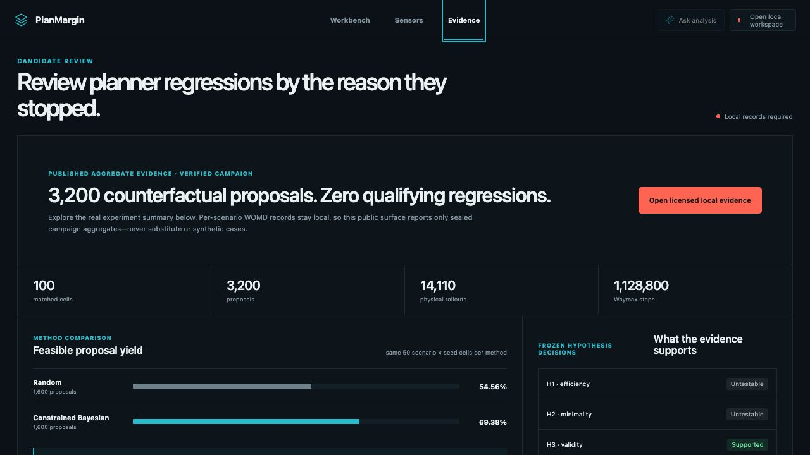
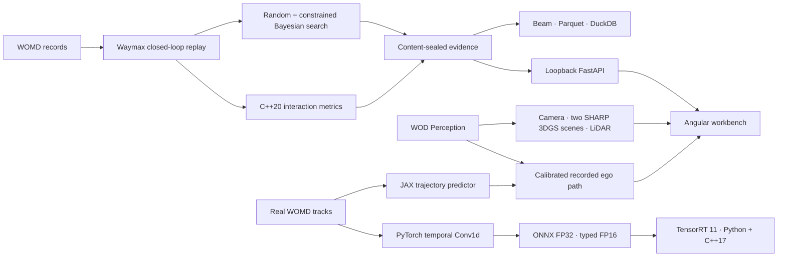

# PlanMargin

**Find realistic scenario changes that isolate planner regressions.**

<!-- prettier-ignore -->
[](https://github.com/ethanvillalovoz/planmargin/actions/workflows/ci.yml)     [](LICENSE)

PlanMargin turns a recorded driving scenario into a reviewable counterfactual:
change lead-vehicle behavior, replay the tested and reference planners under the
same conditions, and keep only cases that are realistic, reproducible, and
specific to the tested planner.

It is an engineering workbench, not a benchmark leaderboard or a Waymo Driver
evaluation.



The public clone opens a useful aggregate analysis surface over the sealed
3,200-proposal campaign. It fails closed only for licensed per-scenario data. An
authorized local launch adds exact proposal replay, candidate investigation,
recorded camera annotations, LiDAR, two 3D Gaussian reconstructions, and a
calibrated real-data JAX trajectory overlay without uploading those artifacts.
The public Evidence view also exposes the sealed 128-scenario PyTorch trajectory
result and measured TensorRT qualification from a free Tesla T4 runtime.

## The engineering workflow

1. **Search** bounded scenario changes with matched random and constrained
   Bayesian budgets.
2. **Reject** physically invalid, unsupported, or non-reproducible candidates.
3. **Isolate** a regression only when the tested planner fails and the reference
   planner succeeds under the same change.
4. **Inspect** the decision in a local workbench with planning replay, camera
   annotations, LiDAR, 3D Gaussian reconstruction, and sealed evidence.

The interface opens on the scene debugger. Campaign statistics live in the
Evidence view, behind the workflow they support. Scores are paired with plain
language such as **tested planner still succeeds**, **outside recorded
behavior**, and **reference planner failed**.


## Run it

### Inspect the public application

The public application contains no fabricated scenario stream:

```bash
git clone https://github.com/ethanvillalovoz/planmargin.git
cd planmargin
cd web/debugger
npm ci
npm start
```

Open `http://127.0.0.1:4200`. Evidence provides the real aggregate campaign
dashboard immediately. Workbench and Sensors explain exactly which licensed
local capabilities become available after an authenticated launch.

### Open the complete local workbench

Python 3.11, [uv](https://docs.astral.sh/uv/), Node 24.15, and a C++20 compiler
are required:

```bash
uv sync --frozen
cd web/debugger && npm ci && cd ../..
uv run --frozen planmargin-doctor --require full
uv run --frozen planmargin-workbench
```

The launcher starts the loopback-only API and the Angular application, opens an
authenticated ephemeral URL, exchanges its token for an HttpOnly same-site
browser-session cookie, and removes the token from the address bar. Refreshes
and additional local tabs reconnect automatically; disconnecting or closing the
browser session clears access. There is no token-copy step and JavaScript cannot
read the session credential. Private responses use `Cache-Control: no-store`,
and source identifiers never enter the UI.

To enable Gemini explanations in that same workbench while keeping the Google
project on its free tier:

```bash
uv sync --frozen --extra assistant
export GEMINI_API_KEY="..."
uv run --frozen --extra assistant planmargin-workbench \
  --assistant-provider gemini \
  --confirm-gemini-free-tier
```

Do not attach billing to the AI Studio project if a hard zero-cost boundary is
required. The adapter makes at most one hosted request after an explicit
question, does not retry automatically, and sends public aggregate facts rather
than local scenario records. A failed hosted request falls back to the labeled,
verified deterministic explanation. See the
[provider contract](docs/evidence-assistant.md).

If the doctor reports missing licensed artifacts, use the
[workspace reproduction runbook](docs/reproducing-the-workspace.md). For the
camera, LiDAR, and 3DGS track, an authorized Waymo Open Dataset account can run:

```bash
uv run --frozen planmargin-train-trajectory-model --epochs 64
uv run --frozen planmargin-bootstrap-sensor --accept-waymo-terms
```

The bootstrap is resumable, uses MPS/CUDA/CPU, downloads only pinned inputs,
and does not require paid compute.

## What the workbench verifies

Every candidate passes through independent gates; PlanMargin never compresses
them into one unexplained score:

| Gate                 | Engineer-facing question                                         |
| -------------------- | ---------------------------------------------------------------- |
| Scenario geometry    | Is the proposed edit physically and map consistent?              |
| Closed-loop validity | Did the mutated scenario remain valid during replay?             |
| Recorded support     | Does comparable behavior exist in the recorded development data? |
| Reproducibility      | Did repeated executions produce identical evidence?              |
| Reference outcome    | Did the conservative control planner remain successful?          |
| Tested outcome       | Did the planner under test actually fail?                        |

Only a candidate that passes all six gates is a planner-specific regression.

## Current evidence, stated without spin

The immutable v1 development campaign evaluated 3,200 proposals across 100
matched cells. It found no qualifying planner regression. Constrained Bayesian
search produced a higher share of support-and-pipeline-valid proposals than
uniform random search, but failure-discovery efficiency and failure minimality
remain untestable because neither method found a qualifying failure. No
validation-backed comparison was opened after that no-go.

The original Stage-0 planning replay is authentic but separate from the
campaign. PlanMargin now also retains five separately versioned replays: the
overall and Bayesian closest-margin cases, a small-edit near-margin case, and
the strongest-support Bayesian and random cases. Each was re-executed from its
authorized WOMD source, and its tested/reference trajectory hashes, outcomes,
interaction metrics, scenario validation, and repeated executions match the
sealed v1 proposal. The other proposal records remain hash-and-metric evidence
unless they are deliberately re-executed through the same verifier.

The WOD Perception camera and LiDAR remain separate from the WOMD/Waymax
counterfactual experiment. The Sensor Lab now contains SHARP reconstructions
for moving frame 20 and stopped frame 99. At frame 20 it registers the recorded
three-second ego path, a real-WOMD-trained JAX prediction, and a constant-
velocity baseline into the SHARP source-camera coordinate system. The model is
held out by scenario and meets its absolute visualization error gates, but does
not beat constant velocity on its test scenario; the UI and report state that
negative comparison rather than claiming model superiority.

A separate TensorRT-friendly PyTorch Conv1d predictor was trained on 29,288
windows from 128 real WOMD scenarios with complete-scenario train/validation/
test separation. On 3,157 test windows it achieved 0.322 m ADE and 0.889 m FDE,
compared with 0.620 m and 1.667 m for constant velocity. Its hash-pinned
[model-only release](https://github.com/ethanvillalovoz/planmargin/releases/tag/trajectory-model-v1)
contains no WOMD records. The exact ONNX graph was qualified on a free Tesla T4
with TensorRT 11.2.1.2: FP32 batch-1 p50 was 0.247 ms, FP16 batch-1 p50 was
0.197 ms, and the independently compiled C++17 runner measured 0.124 ms p50.
The published reports retain every percentile, batch, parity value, gate,
environment version, and artifact hash.

Read the [aggregate result](docs/natural-development-results.md) and
[held-out decision](docs/decisions/0003-version-one-heldout-no-go.md) for the
frozen claim boundary.

## System architecture



| Responsibility   | Implementation                       | Verification                                            |
| ---------------- | ------------------------------------ | ------------------------------------------------------- |
| Simulation       | Python, JAX, Waymax                  | fixed scenario contracts and deterministic reruns       |
| Search           | PyTorch, BoTorch qLogNEHVI           | equal budgets, five seeds, frozen gates                 |
| Native metrics   | C++20, pybind11                      | randomized Python-oracle parity                         |
| Dataflow         | Apache Beam, Parquet, DuckDB         | stable partitions and SQL reconciliation                |
| Evidence service | FastAPI                              | loopback auth, closed response models, path confinement |
| Product          | Angular, TypeScript, Three.js, Spark | strict types, component tests, production build         |
| Reconstruction   | Apple SHARP                          | pinned source, model hash, MPS/CUDA/CPU execution       |
| Trajectory model | JAX, Optax, real WOMD tracks         | scenario holdout, baseline comparison, sealed checkpoint |
| Deployable model | PyTorch, ONNX, TensorRT 11           | 128-scenario holdout, FP32/FP16 parity, CUDA-event timing |
| NVIDIA runtime   | Python and C++17 `enqueueV3`          | Tesla T4, 500 runs per batch, sealed hashes and versions  |
| Assistant        | deterministic tools, optional Gemini | allowlisted evidence and sealed citations               |
| Replay retention | Python, JAX, Waymax                  | proposal seal, trajectory-hash and metric matching      |

## Data and distribution boundary

PlanMargin separates public code and aggregate results from licensed local
evidence:

| Surface                              | Public clone      | Authorized local workspace                   |
| ------------------------------------ | ----------------- | -------------------------------------------- |
| Source, schemas, tests, architecture | Included          | Included                                     |
| Aggregate experiment decision        | Included          | Included                                     |
| Model-only PyTorch and ONNX artifacts | Versioned release | Versioned release                            |
| TensorRT latency and parity report    | Included          | Included                                     |
| TensorRT engine binaries              | Rebuilt per GPU   | Rebuilt per GPU                              |
| Per-proposal records and exact gates | Not redistributed | Seal-verified locally                        |
| Planning and proposal-linked replays | Not redistributed | Seal- and hash-verified locally               |
| Camera, annotations, LiDAR, and 3DGS | Not redistributed | Seal-verified locally                        |
| Deterministic evidence assistant     | Aggregate scope   | Local evidence scope                         |
| Gemini explanation                   | Optional          | User key and explicit free-tier confirmation |

This is a licensing boundary, not a synthetic-data fallback.

To retain another accepted proposal locally, use its one-based campaign
identity:

```bash
uv run --frozen planmargin-retain-proposal-replay \\
  --method random \\
  --seed 1 \\
  --selection-order 8 \\
  --proposal-number 12
```

The command refuses rejected proposals and existing outputs. It publishes
nothing: the resulting package stays under the ignored
`artifacts/proposal-replays/` boundary.

## Verify the repository

```bash
uv run --frozen ruff check .
uv run --frozen pytest
uv build
cd web/debugger && npm run check
```

To reproduce the NVIDIA deployment result without downloading WOMD records,
open [`notebooks/planmargin_tensorrt_colab.ipynb`](notebooks/planmargin_tensorrt_colab.ipynb)
in a free T4 Colab runtime. It downloads and verifies the model-only release,
builds FP32 and typed-FP16 engines, runs 50 warmups plus 500 measured iterations
at batches 1, 8, and 256, and compiles the C++17 cross-check.

`uv run --frozen planmargin-doctor` reports exactly which public and authorized
artifacts are present instead of silently degrading the product.

## Repository map

| Path                                         | Responsibility                                                 |
| -------------------------------------------- | -------------------------------------------------------------- |
| [`src/planmargin`](src/planmargin)           | simulation, search, evidence API, assistant, readiness tooling |
| [`cpp`](cpp)                                 | C++20 metrics kernel and C++17 TensorRT runtime                 |
| [`web/debugger`](web/debugger)               | Angular/TypeScript/Three.js/Spark workbench                    |
| [`schemas`](schemas)                         | versioned experiment and analytics contracts                   |
| [`tests`](tests)                             | data-free science, parity, API, privacy, and setup checks      |
| [`docs`](docs)                               | architecture, protocols, decisions, results, and runbooks      |
| [`release/huggingface`](release/huggingface) | aggregate-only package; no WOD scene files                     |

Start with [using the workbench](docs/using-the-workbench.md), the
[architecture](docs/architecture.md),
[workspace reproduction](docs/reproducing-the-workspace.md),
[evidence API](docs/evidence-api.md), and [contribution guide](CONTRIBUTING.md).
Security reports follow the [security policy](SECURITY.md).

## License and affiliation

PlanMargin is independent and is **not affiliated with, endorsed by, or
representative of Waymo LLC**. It does not evaluate the production Waymo
Driver.

This software was made using the Waymo Open Dataset, provided by Waymo LLC
under the [Waymo Dataset License Agreement for Non-Commercial Use](https://waymo.com/open/terms/).
WOD source data and restricted per-scenario derivatives are not included in
this repository.

Original PlanMargin code is licensed under [Apache License 2.0](LICENSE).
Dataset terms, model terms, and third-party licenses remain separate; see
[NOTICE](NOTICE).
