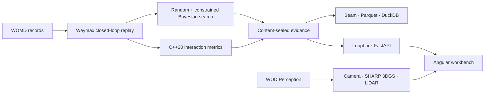

# PlanMargin

**Find realistic scenario changes that isolate planner regressions.**

<!-- prettier-ignore -->
[](https://github.com/ethanvillalovoz/planmargin/actions/workflows/ci.yml)    [](LICENSE)

PlanMargin turns a recorded driving scenario into a reviewable counterfactual:
change lead-vehicle behavior, replay the tested and reference planners under the
same conditions, and keep only cases that are realistic, reproducible, and
specific to the tested planner.

It is an engineering workbench, not a benchmark leaderboard or a Waymo Driver
evaluation.

## The engineering workflow

1. **Search** bounded scenario changes with matched random and constrained
   Bayesian budgets.
2. **Reject** physically invalid, unsupported, or non-reproducible candidates.
3. **Isolate** a regression only when the tested planner fails and the reference
   planner succeeds under the same change.
4. **Inspect** the decision in a local workbench with planning replay, camera
   annotations, LiDAR, 3D Gaussian reconstruction, and sealed evidence.

The interface opens on the scene debugger. Campaign statistics live in the
Evidence view, behind the workflow they support. Scores are paired with plain
language such as **tested planner still succeeds**, **outside recorded
behavior**, and **reference planner failed**.

## Run it

### Inspect the public application

The public application contains no fabricated scenario stream:

```bash
git clone https://github.com/ethanvillalovoz/planmargin.git
cd planmargin
cd web/debugger
npm ci
npm start
```

Open `http://127.0.0.1:4200`. The workbench shows the licensed-data boundary
until an authorized local evidence service is available.

### Open the complete local workbench

Python 3.11, [uv](https://docs.astral.sh/uv/), Node 24.15, and a C++20 compiler
are required:

```bash
uv sync --frozen
cd web/debugger && npm ci && cd ../..
uv run --frozen planmargin-doctor --require full
uv run --frozen planmargin-workbench
```

The launcher starts the loopback-only API and the Angular application, opens an
authenticated ephemeral URL, consumes the token into browser memory, and removes
it from the address bar. There is no token-copy step. Private responses use
`Cache-Control: no-store`, and source identifiers never enter the UI.

To enable Gemini explanations in that same workbench while keeping the Google
project on its free tier:

```bash
uv sync --frozen --extra assistant
export GEMINI_API_KEY="..."
uv run --frozen --extra assistant planmargin-workbench \
  --assistant-provider gemini \
  --confirm-gemini-free-tier
```

Do not attach billing to the AI Studio project if a hard zero-cost boundary is
required. The adapter makes one hosted request only after an explicit question,
does not retry automatically, and sends public aggregate facts rather than local
scenario records. See the [provider contract](docs/evidence-assistant.md).

If the doctor reports missing licensed artifacts, use the
[workspace reproduction runbook](docs/reproducing-the-workspace.md). For the
camera, LiDAR, and 3DGS track, an authorized Waymo Open Dataset account can run:

```bash
uv run --frozen planmargin-bootstrap-sensor --accept-waymo-terms
```

The bootstrap is resumable, uses MPS/CUDA/CPU, downloads only pinned inputs,
and does not require paid compute.

## What the workbench verifies

Every candidate passes through independent gates; PlanMargin never compresses
them into one unexplained score:

| Gate                 | Engineer-facing question                                         |
| -------------------- | ---------------------------------------------------------------- |
| Scenario geometry    | Is the proposed edit physically and map consistent?              |
| Closed-loop validity | Did the mutated scenario remain valid during replay?             |
| Recorded support     | Does comparable behavior exist in the recorded development data? |
| Reproducibility      | Did repeated executions produce identical evidence?              |
| Reference outcome    | Did the conservative control planner remain successful?          |
| Tested outcome       | Did the planner under test actually fail?                        |

Only a candidate that passes all six gates is a planner-specific regression.

## Current evidence, stated without spin

The immutable v1 development campaign evaluated 3,200 proposals across 100
matched cells. It found no qualifying planner regression. Constrained Bayesian
search produced a higher share of support-and-pipeline-valid proposals than
uniform random search, but failure-discovery efficiency and failure minimality
remain untestable because neither method found a qualifying failure. No
validation-backed comparison was opened after that no-go.

The retained Stage-0 planning replay is authentic but separate from proposal
records whose full trajectories were not stored. The WOD Perception camera,
LiDAR, and Apple SHARP reconstruction are also a separate visual track. The UI
labels those boundaries instead of implying synchronization that does not
exist.

Read the [aggregate result](docs/natural-development-results.md) and
[held-out decision](docs/decisions/0003-version-one-heldout-no-go.md) for the
frozen claim boundary.

## System architecture



| Responsibility   | Implementation                       | Verification                                            |
| ---------------- | ------------------------------------ | ------------------------------------------------------- |
| Simulation       | Python, JAX, Waymax                  | fixed scenario contracts and deterministic reruns       |
| Search           | PyTorch, BoTorch qLogNEHVI           | equal budgets, five seeds, frozen gates                 |
| Native metrics   | C++20, pybind11                      | randomized Python-oracle parity                         |
| Dataflow         | Apache Beam, Parquet, DuckDB         | stable partitions and SQL reconciliation                |
| Evidence service | FastAPI                              | loopback auth, closed response models, path confinement |
| Product          | Angular, TypeScript, Three.js, Spark | strict types, component tests, production build         |
| Reconstruction   | Apple SHARP                          | pinned source, model hash, MPS/CUDA/CPU execution       |
| Assistant        | deterministic tools, optional Gemini | allowlisted evidence and sealed citations               |

## Data and distribution boundary

PlanMargin separates public code and aggregate results from licensed local
evidence:

| Surface                              | Public clone      | Authorized local workspace                   |
| ------------------------------------ | ----------------- | -------------------------------------------- |
| Source, schemas, tests, architecture | Included          | Included                                     |
| Aggregate experiment decision        | Included          | Included                                     |
| Per-proposal records and exact gates | Not redistributed | Seal-verified locally                        |
| Planning replay                      | Not redistributed | Seal-verified locally                        |
| Camera, annotations, LiDAR, and 3DGS | Not redistributed | Seal-verified locally                        |
| Deterministic evidence assistant     | Aggregate scope   | Local evidence scope                         |
| Gemini explanation                   | Optional          | User key and explicit free-tier confirmation |

This is a licensing boundary, not a synthetic-data fallback.

## Verify the repository

```bash
uv run --frozen ruff check .
uv run --frozen pytest
uv build
cd web/debugger && npm run check
```

`uv run --frozen planmargin-doctor` reports exactly which public and authorized
artifacts are present instead of silently degrading the product.

## Repository map

| Path                                         | Responsibility                                                 |
| -------------------------------------------- | -------------------------------------------------------------- |
| [`src/planmargin`](src/planmargin)           | simulation, search, evidence API, assistant, readiness tooling |
| [`cpp`](cpp)                                 | C++20 interaction-metrics kernel                               |
| [`web/debugger`](web/debugger)               | Angular/TypeScript/Three.js/Spark workbench                    |
| [`schemas`](schemas)                         | versioned experiment and analytics contracts                   |
| [`tests`](tests)                             | data-free science, parity, API, privacy, and setup checks      |
| [`docs`](docs)                               | architecture, protocols, decisions, results, and runbooks      |
| [`release/huggingface`](release/huggingface) | aggregate-only package; no WOD scene files                     |

Start with [using the workbench](docs/using-the-workbench.md), the
[architecture](docs/architecture.md),
[workspace reproduction](docs/reproducing-the-workspace.md),
[evidence API](docs/evidence-api.md), and [contribution guide](CONTRIBUTING.md).
Security reports follow the [security policy](SECURITY.md).

## License and affiliation

PlanMargin is independent and is **not affiliated with, endorsed by, or
representative of Waymo LLC**. It does not evaluate the production Waymo
Driver.

This software was made using the Waymo Open Dataset, provided by Waymo LLC
under the [Waymo Dataset License Agreement for Non-Commercial Use](https://waymo.com/open/terms/).
WOD source data and restricted per-scenario derivatives are not included in
this repository.

Original PlanMargin code is licensed under [Apache License 2.0](LICENSE).
Dataset terms, model terms, and third-party licenses remain separate; see
[NOTICE](NOTICE).
