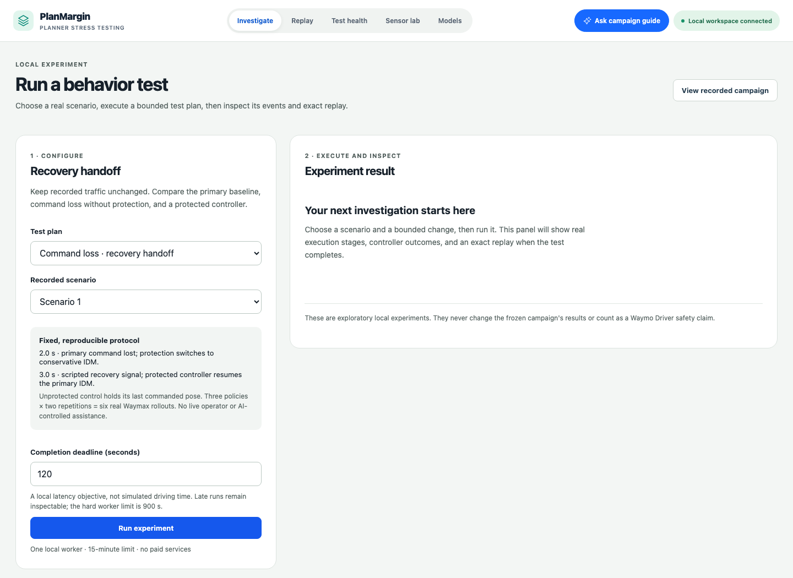
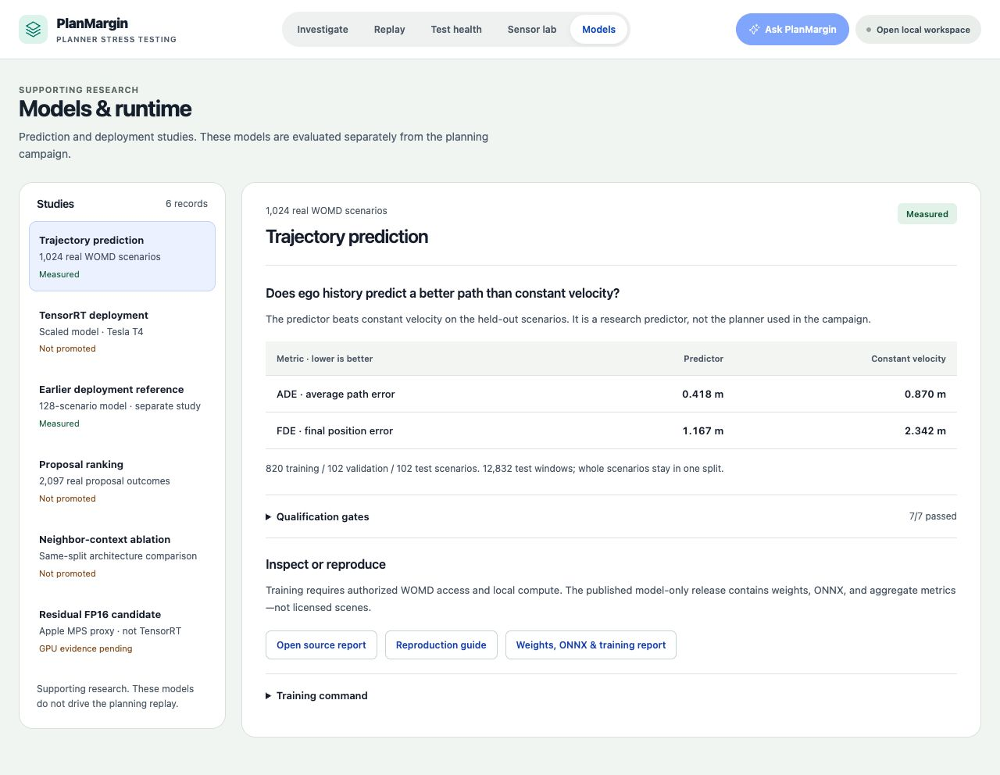
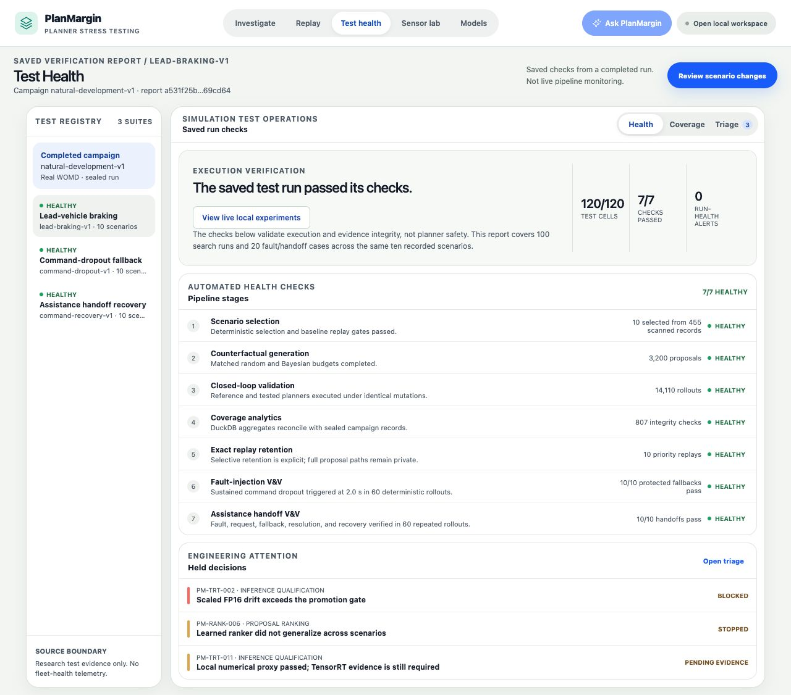

# PlanMargin

**Stress-test a driving planner. Reproduce what happened.**

An independent, local workbench for stress-testing driving planners on real
Waymo Open Motion Dataset scenarios—from a controlled change or command fault to
an exact replay, a traceable diagnosis, and a verified rerun.

[](https://github.com/ethanvillalovoz/planmargin/actions/workflows/ci.yml)
[](LICENSE)

[Try it locally](#try-it-locally) ·
[Reproduce a real case](docs/case-study-close-clearance.md) ·
[Run an experiment](docs/running-experiments.md) ·
[Workbench guide](docs/using-the-workbench.md) ·
[Contribute](CONTRIBUTING.md)

[](docs/running-experiments.md)

*Actual first-run screen after preparing a clean local workspace. Configure,
execute, inspect, and replay a test in one place. No fabricated result or
licensed scene content is shown in this capture.*

## What happens when a scenario changes?

A planner can finish its route and still leave very little room for error.
PlanMargin helps you investigate that difference: change the lead vehicle's
braking, run a tested controller and a conservative reference, then inspect the
outcome and the exact trajectories that produced it.

1. **Choose a test.** Lead braking, command-loss protection, or deterministic
   recovery handoff. Select a recorded scenario and declare a completion deadline.
2. **Run it locally.** Follow real worker stages, cancel, or return later. Each
   policy runs twice to check exact trajectory repeatability.
3. **Diagnose the outcome.** Separate execution failure from a behavior-test
   failure. Inspect the failed gate, timing, clearance, or recovered progress.
4. **Replay and reproduce.** Jump to clearance or fault/recovery events, download
   the verified JSON, and prepare a linked rerun. Resolution never erases failure history.

| Test plan | Question it answers | What runs |
| --- | --- | --- |
| Lead braking | Does a bounded traffic change expose a failure the reference avoids? | Original/changed × tested/reference × two repetitions |
| Command-loss protection | Does the fallback preserve valid motion after primary-command loss? | Baseline, unprotected, protected × two repetitions |
| Recovery handoff | Does the protected controller resume primary operation at the expected step? | Baseline, unprotected, protected with a scripted recovery signal × two repetitions |

**Test health** has separate **Live local runs** and **Saved campaign** views.
Live diagnostics include worker failures, missed declared deadlines, failed
behavior gates, and explicit rerun resolution—not fabricated fleet telemetry.

### A real case: less room, but no qualifying failure

With a **+0.2 s braking shift** and **0.879× lead speed**, the tested controller's
minimum signed clearance fell from **29.5 cm to 3.2 cm**. The reference retained
**4.80 m**. Both controllers still succeeded.

PlanMargin reports **not a qualifying regression**: proximity alone does not
establish a failure that the reference avoids. The same run was reproduced in
a separate checkout on the same Mac, with matching trajectory hashes and outcomes.

[See the configuration, gates, and reproduction commands →](docs/case-study-close-clearance.md)

## Try it locally

### Explore the included results — no dataset account required

Requires **Node 24.15 / npm 11**. With `nvm` installed:

```bash
git clone https://github.com/ethanvillalovoz/planmargin.git
cd planmargin
nvm install
nvm use
cd web/debugger
npm ci
npm start
```

Open [localhost:4200](http://127.0.0.1:4200). Start with **Test health → Triage**
to inspect a held decision, or **Models** to compare a study with its baseline.
The included results are real public aggregates. Running new experiments and
viewing scene replays requires your own authorized local dataset workspace.

### Run your own scenario change

The planning workflow needs **Python 3.11, uv, a C++20 compiler, Google Cloud CLI,
and authorized Waymo Open Dataset access**. No GPU, Gemini key, or paid cloud
resource is required.

<details>
<summary><strong>Planning setup and first experiment</strong></summary>

Install the frontend above, then stop its `npm start` process: the combined
workbench also uses port 4200. From the repository root:

```bash
uv sync --frozen
gcloud auth login
gcloud auth application-default login
./scripts/verify_womd_access.sh
```

Review [the dataset terms](https://waymo.com/open/terms/) and obtain access
before using the acceptance flag:

```bash
uv run --frozen planmargin-prepare-planning --accept-waymo-terms
uv run --frozen planmargin-workbench --planning-only
```

The launcher opens an authenticated local session. Choose **Scenario 1**, keep
**+0.0 s / 0.90×**, and click **Run experiment**. Keep the launcher terminal open.
Planning-only mode reduces data preparation, not the Python dependency installation.

To evaluate the recorded-behavior support gate, also prepare its empirical model:

```bash
uv run --frozen planmargin-build-empirical-support
```

This resumable command scans 16 prescribed WOMD shards. Without it, simulation
can run, but realism qualification remains explicitly unavailable.

[Detailed setup, CLI, resource limits, and recovery](docs/running-experiments.md) ·
[Full campaign and sensor reproduction](docs/reproducing-the-workspace.md)

</details>

## Explore the workbench

| Your question | Where to go |
| --- | --- |
| Which change deserves a closer look? | **Investigate** — rank changes, compare attempts, and open retained proposal replays |
| What did the planner actually do? | **Replay** — play the selected trajectories and inspect the closest approach |
| Did the tests execute correctly? | **Test health** — inspect saved integrity checks, versioned coverage, and triage paths; follow live local jobs separately |
| What do the sensors show? | **Sensor lab** — camera annotations, LiDAR, and three SHARP 3D Gaussian reconstructions from a separate Perception segment |
| Is a model ready to promote? | **Models** — six studies with baselines, qualification gates, source reports, and reproduction materials |
| What does the campaign evidence mean? | **Ask PlanMargin** — verified campaign facts with optional Gemini explanations |

### Compare a model with its evidence

[](docs/research-evidence.md)

*Actual public Models screen. Each study keeps its measurements and promotion
decision together. These research models do not silently replace the planning controller.*

<details>
<summary><strong>Inspect the saved campaign's test health</strong></summary>

[](docs/using-the-workbench.md)

This screen uses real public aggregate reports included in the repo. New
experiment diagnostics appear separately under **Live local runs**.

</details>

## Under the hood

| Layer | Implementation |
| --- | --- |
| Scenario execution | Python / JAX / Waymax; isolated, cancellable worker; original and changed scenes × tested and reference controllers × repeated execution |
| Metrics and evidence | C++20 interaction metrics, independent finding gates, and hash-sealed result/replay records |
| Data and test coverage | Apache Beam, Parquet, and DuckDB/SQL analytics over the recorded campaign |
| Local workbench | Authenticated FastAPI service and Angular investigation, comparison, and replay UI |
| Supporting research | PyTorch prediction, ONNX/TensorRT measurements, and a separate C++17 inference benchmark |

[Architecture and component responsibilities](docs/research-evidence.md#system-architecture) ·
[Research results](docs/research-evidence.md) ·
[Verification record](docs/product-completion.md)

## Scope and evidence

- **A specific testing problem.** Ten selected lead-braking scenarios,
  configurable tested Waymax IDM, and a fixed conservative reference—not
  arbitrary planner plugins or the production Waymo Driver.
- **Real results, including negative ones.** The frozen campaign evaluated
  3,200 proposals and found zero qualifying regressions. Bayesian search improved
  valid-proposal yield; superior failure discovery was not demonstrated.
  New local experiments do not rewrite that campaign.
- **Local data, public aggregates.** Licensed scenes, trajectories, camera
  frames, and reconstructions stay out of Git. The screenshots above show only
  the public application. There is intentionally no hosted dashboard in this release
  and no automatic publishing.
- **Separate research surfaces.** The three SHARP assets are independent
  single-image reconstructions, not a fused dynamic world. Some model/RL
  hypotheses failed qualification; historical synthetic RL evidence is labeled.
- **Optional, bounded Gemini.** Your key and free-tier confirmation are required.
  Only allowlisted public campaign aggregates are sent. Fallback is labeled;
  the assistant is not an autonomous agent over private experiment jobs.

[Data handling](data/README.md) · [Security](SECURITY.md) ·
[Dependency exceptions](docs/dependency-security.md) ·
[Assistant setup](docs/evidence-assistant.md)

## Develop and contribute

The documented workflow has been exercised on macOS Apple silicon; CI covers
data-free checks on Ubuntu x86-64. Windows/WSL and other browser engines are
not verified targets. Stop the dev server before replacing dependencies with `npm ci`.

```bash
uv run --frozen ruff check .
uv run --frozen pytest
uv build
cd web/debugger
npm run check
npm run e2e
```

Tests cover numerical parity, evidence contracts, authentication, worker lifecycle,
cancellation, replay integrity, and desktop/mobile interactions. Browser contract
tests use fixtures; the [real-data case study](docs/case-study-close-clearance.md)
and [completion record](docs/product-completion.md) document separately executed verification.

Start with the [contribution guide](CONTRIBUTING.md). Open an issue with the
expected behavior, actual behavior, and a reproducible configuration. Keep
licensed records and credentials out of public reports; report security issues
through [private vulnerability reporting](SECURITY.md).

## License and affiliation

PlanMargin is independent and **not affiliated with, endorsed by, or
representative of Waymo LLC**. It does not certify vehicle safety.

This software was made using the Waymo Open Dataset, provided by Waymo LLC
under the [Waymo Dataset License Agreement for Non-Commercial Use](https://waymo.com/open/terms/).
WOD source data and restricted per-scenario derivatives are not included.

Original code is licensed under [Apache License 2.0](LICENSE). Dataset, model,
and third-party terms remain separate; see [NOTICE](NOTICE).
