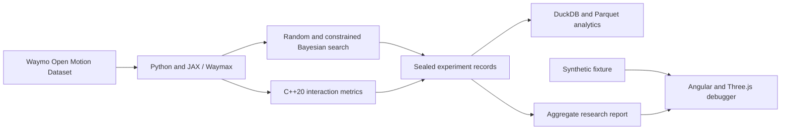

# PlanMargin

**Counterfactual stress testing for autonomous-driving planners.**

PlanMargin is an independent research and engineering project that searches for the smallest realistic change to a recorded driving scenario that exposes an avoidable planner failure.

> **Current status:** The frozen 100-cell natural development comparison is
> complete: both methods evaluated 1,600 proposals, neither found a qualifying
> failure, and constrained Bayesian search increased the aggregate
> support-and-pipeline-valid rate from 54.5625% to 69.3750%. H1 efficiency and
> H2 minimality are therefore untestable; H3 validity is supported under its
> predeclared noninferiority rule. The held-out evaluation remains unopened.
> See the [aggregate-only results](docs/natural-development-results.md). No
> production-planner performance claim is made.

## Five-minute review


1. Read the [aggregate result](docs/natural-development-results.md): 100 matched
   cells, 3,200 proposals, zero qualifying findings, H1/H2 untestable, and H3
   supported.
2. Open the local debugger below and select `Proposal 02` to inspect how the
   synthetic finding contract, trajectories, and metric timelines fit together.
3. Select **Campaign results** to see the real aggregate evidence and its claim
   boundary, or open `http://127.0.0.1:4200/?evidence=1` directly.
4. Review the [DuckDB/Parquet reconciliation](docs/analytics.md) and the
   [measured C++20 kernel](docs/native-geometry.md) for data and systems depth.
5. Review the [held-out decision](docs/decisions/0003-version-one-heldout-no-go.md)
   for the negative-result judgment: validation remained unopened instead of
   tuning the protocol after observing no failures.

## The problem

Autonomous-driving planners can perform well on average while remaining sensitive to small changes in difficult interactions. Randomly mutating scenarios wastes simulation time, and simply generating collisions is not useful: a collision may be physically implausible or unavoidable by any controller.

PlanMargin asks:

> Can realism-constrained Bayesian search find avoidable, policy-specific failures in recorded driving scenarios using fewer simulations than random search?

For example, consider an unprotected left turn that succeeds in the recorded data. If an oncoming vehicle arrives 0.6 seconds earlier:

- Does the tested planner still respond safely?
- Is the timing change physically and behaviorally plausible?
- Could a conservative reference controller avoid the event?
- What is the smallest change that crosses the planner's failure boundary?

## What counts as a finding?

A generated event is accepted only when all of the following are true:

1. The tested planner passes the original scenario.
2. The mutation is physically feasible and map-compliant.
3. The mutated behavior resembles motion observed in real data.
4. The tested planner fails or crosses a defined critical-risk threshold.
5. A conservative reference controller succeeds under the identical mutation.
6. The outcome is reproducible.

This prevents the search process from “winning” by creating impossible or inevitable crashes.

## Version-one experiment

The completed development experiment used a deliberately narrow scope:

- **Data:** Waymo Open Motion Dataset (WOMD)
- **Simulator:** Waymax
- **Scenario family:** lead-vehicle braking, selected after the bounded unprotected-left-turn probe triggered the feasibility fallback
- **Mutations:** braking-onset offset and speed multiplier for the lead vehicle
- **Baseline:** uniform random search
- **Proposed method:** constrained Bayesian optimization
- **Primary metrics:** valid failure discovery rate, simulations to first valid failure, minimum mutation distance, realism pass rate, and reference-controller avoidability rate

The comparison used equal rollout budgets on the frozen training scenarios.
The held-out split remains unopened under the version-one `no_go` decision.

## Implemented architecture



The implemented stack is Python, JAX/Waymax, PyTorch/BoTorch, C++20/pybind11,
DuckDB, Parquet, Angular, TypeScript, Three.js, and GitHub Actions. Beam,
FastAPI, hosted infrastructure, and an AI explanation layer were not added
because version one did not give them a necessary responsibility.

## Zero-cost design constraint

The core project must run without purchasing compute or hosted infrastructure.

- Local preprocessing, C++, SQL, visualization, and small-model work run on an Apple-silicon Mac.
- JAX/Waymax runs locally on CPU or opportunistically on Colab Free.
- PyTorch MPS is the fallback for learned components.
- Every remote job must be sharded, checkpointed, and resumable.
- No milestone may depend on receiving a particular Colab GPU.

## Roadmap

- [x] Validate credential-safe WOMD access and replay one scenario twice
- [x] Select and replay ten WOMD interaction scenarios in Waymax
- [x] Apply one bounded speed or timing mutation
- [x] Run tested and reference controllers
- [x] Export trajectories and evaluation metrics
- [x] Produce the first original-versus-counterfactual visualization
- [x] Validate the initial scenario family
- [x] Implement random-search baseline
- [x] Freeze the version-one product checkpoint
- [x] Resolve the behavioral-realism contract and freeze matched search
- [x] Implement the WOMD empirical-support gate
- [x] Implement the data-free constrained-Bayesian proposal core
- [x] Implement method-neutral matched-search records and coordination
- [x] Run the one-scenario, two-proposal private integration smoke test
- [x] Establish controlled headway-regression original eligibility (`no_go`)
- [x] Build the thin interactive scenario-debugger slice
- [x] Run the complete natural development comparison
- [x] Resolve the version-one held-out gate (`no_go`; split remains unopened)
- [x] Add the private DuckDB/Parquet analytical data layer
- [x] Add measured C++20 interaction-metrics optimization
- [x] Polish the reproducible recruiter-facing demonstration

See the [local setup guide](docs/setup.md),
[scenario-selection protocol](docs/scenario-selection.md),
[speed-mutation protocol](docs/speed-mutation.md),
[controller-comparison protocol](docs/controller-comparison.md),
[rollout-record protocol](docs/rollout-record.md),
[trajectory-visualization protocol](docs/trajectory-visualization.md),
[lead-braking family-validation protocol](docs/family-validation.md),
[deterministic random-search protocol](docs/random-search.md),
[WOMD empirical-support and matched-search protocol](docs/behavioral-realism-and-matched-search.md),
[WOMD empirical-support implementation](docs/empirical-support.md),
[matched-search proposal core](docs/matched-search-proposal-core.md),
[matched-search cell coordinator](docs/matched-search-coordinator.md),
[natural development campaign](docs/matched-search-campaign.md),
[natural development results](docs/natural-development-results.md),
[private campaign analytics](docs/analytics.md),
[measured C++20 interaction metrics](docs/native-geometry.md),
[private matched-search integration smoke test](docs/matched-search-private-smoke.md),
[controlled headway-regression eligibility](docs/regression-eligibility.md),
[scenario debugger design and verification contract](docs/debugger-design.md),
[project specification](docs/project-spec.md),
[architecture](docs/architecture.md),
[initial scope decision](docs/decisions/0001-project-scope.md),
[version-one product checkpoint](docs/decisions/0002-version-one-product-checkpoint.md), and
[version-one held-out decision](docs/decisions/0003-version-one-heldout-no-go.md)
for details.

## Local scenario debugger

The thin debugger uses a bundled synthetic fixture and does not discover or
upload private dataset records. With Node.js 24.15.0 or a compatible Node 24
release:

```bash
cd web/debugger
npm ci
npm start
```

Open `http://127.0.0.1:4200`. The interface supports proposal selection,
play/pause/step, timeline scrubbing, responsive Scene/Evidence/Metrics views,
strictly validated synthetic JSON files, a compact view export, and an
aggregate-only campaign evidence surface. No private scenario, cell, or
proposal data is bundled. Run `npm run check` for strict typechecking, unit
tests, and a production build.

## Reproducibility principles

- Every local rollout result must retain its scenario ID, code revision,
  configuration, seed, and metric definitions.
- Raw and per-scenario derived Waymo data will not be committed. Public reports
  contain only permitted aggregate results and data-free methodology.
- Tiny synthetic fixtures will test geometry and evaluation behavior without requiring dataset access.
- Unsuccessful experiments will be documented when they change the project direction.
- Results will be reported with limitations rather than converted into unsupported safety claims.

## Data, licensing, and affiliation

PlanMargin is an independent project and is **not affiliated with, endorsed by, or representative of Waymo LLC**. It does not evaluate the production Waymo Driver.

Waymo Open Dataset and Waymax access are governed by their respective terms and non-commercial-use conditions. Users are responsible for obtaining access and accepting those terms. Raw data, credentials, and restricted artifacts must never be committed here. See [data/README.md](data/README.md).

This software was made using the Waymo Open Dataset, provided by Waymo LLC
under the [Waymo Dataset License Agreement for Non-Commercial Use](https://waymo.com/open/terms/),
and access and use are governed by that agreement.

The original code in this repository is licensed under the Apache License 2.0. Third-party software and datasets retain their own licenses.
