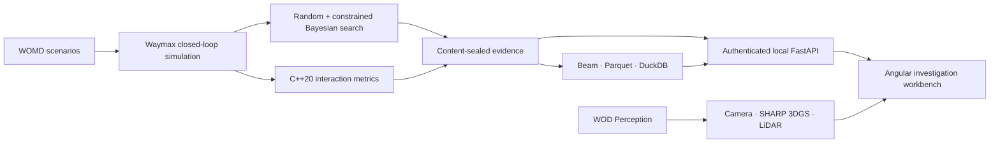

# PlanMargin

**Counterfactual stress testing for autonomous-driving planners.**

<!-- prettier-ignore -->
[](https://github.com/ethanvillalovoz/planmargin/actions/workflows/ci.yml)    [](LICENSE)

PlanMargin searches for the smallest realistic change to a recorded driving
scenario that makes a tested planner fail while a conservative reference still
succeeds. It is a reproducible research system and an interactive engineering
workbench—not a Waymo Driver evaluation.

The completed v1 experiment ran **3,200 matched proposals**, **14,110 physical
rollouts**, and **1,128,800 Waymax steps**. Neither search method found a
qualifying failure. Constrained Bayesian search did increase the
support-and-pipeline-valid proposal rate from **54.5625% to 69.3750%**. The
negative result and its limits are preserved instead of being converted into a
post-hoc win.


## Product at a glance

The local workbench gives an engineer four connected surfaces:

- **Investigate:** rank all 3,200 sealed proposals, compare candidates, and
  trace the exact qualification gate where each proposal stopped.
- **Replay:** inspect the authentic retained planning trajectory on its own
  timeline. Campaign proposals without retained trajectories are never
  presented as playable replays.
- **Sensor Lab:** play 199 recorded WOD FRONT frames with 8,364 native tracked
  boxes, orbit a 1,179,648-primitive Apple SHARP 3D Gaussian reconstruction,
  and inspect a 50,241-primitive same-frame LiDAR field.
- **Evidence assistant:** ask bounded questions through deterministic local
  tools, with an optional Gemini explanation adapter that only receives
  already-public aggregates.



## What is ready

PlanMargin deliberately distinguishes public code from licensed local data.
Run the doctor instead of guessing:

```bash
uv run --frozen planmargin-doctor
```

| Surface                                | Clean public clone | Authorized local workspace                                       |
| -------------------------------------- | ------------------ | ---------------------------------------------------------------- |
| Source, schemas, tests, architecture   | Ready              | Ready                                                            |
| Aggregate campaign result              | Ready              | Ready                                                            |
| 3,200 proposal records and exact gates | Not redistributed  | Verified locally                                                 |
| Planning replay                        | Not redistributed  | Verified locally                                                 |
| Camera, tracked boxes, 3DGS, and LiDAR | Not redistributed  | Verified locally                                                 |
| Deterministic evidence assistant       | Aggregate mode     | Full local evidence                                              |
| Gemini explanation                     | Optional           | Requires a user-supplied key and explicit free-tier confirmation |

This is a licensing boundary, not a synthetic-data fallback. The production
application bundles no fake scenario or fake sensor stream.

## Quick start

### Review the public product

The aggregate workbench only needs Node 24.15:

```bash
git clone https://github.com/ethanvillalovoz/planmargin.git
cd planmargin
cd web/debugger
npm ci
npm start
```

Open `http://127.0.0.1:4200`. The public aggregate investigation opens without
credentials.

For the scientific and systems checks, install
[uv](https://docs.astral.sh/uv/), Python 3.11, and a C++20 compiler. These
exercise the scientific contracts, native-kernel parity, API boundary, privacy
policy, and frontend:

```bash
uv run --frozen ruff check .
uv run --frozen pytest
uv build
cd web/debugger && npm run check
```

### Prepare the authorized Sensor Lab

After registering for the Waymo Open Dataset, accepting its current terms, and
authenticating the Google Cloud CLI, one command downloads only the four pinned
Perception components, installs the pinned Apple SHARP tool, runs MPS/CUDA/CPU
inference, and seals the Camera/3DGS/LiDAR scene:

```bash
uv run --frozen planmargin-bootstrap-sensor --accept-waymo-terms
```

The bootstrap is resumable: existing nonempty inputs, the 3DGS model output,
and the prepared scene are reused. It does not purchase compute or require a
hosted service. The first SHARP run downloads Apple's model checkpoint and can
take substantial time and disk space.

### Launch the complete local workbench

The authenticated investigator also requires locally reproduced or retained
campaign, analytics, and planning-replay artifacts. Check the exact state first:

```bash
uv run --frozen planmargin-doctor --require full
.venv/bin/python scripts/launch_debugger.py
```

The launcher starts the loopback-only API and Angular application together and
prints one ephemeral token. Paste it into **Connect real evidence**; the token
stays in memory and every private response is marked `no-store`.

For a new authorized machine, follow the
[campaign reproduction runbook](docs/reproducing-the-workspace.md). It is a
long-running scientific reproduction, not a sample-data download.

## Scientific contract

A proposal qualifies only if all of the following hold under deterministic
reruns:

1. The original scenario passes.
2. The mutation passes physical, map, and empirical-behavior gates.
3. The tested controller fails or crosses the frozen risk threshold.
4. The conservative technical reference succeeds under the same mutation.
5. The result reproduces exactly.

The comparison used equal 1,600-proposal budgets for uniform random search and
constrained multi-objective qLogNEHVI. The completed development campaign found
zero qualifying failures, making discovery efficiency (H1) and failure
minimality (H2) untestable. The predeclared validity hypothesis (H3) was
supported. No validation-backed comparative campaign ran.

Read the [aggregate result](docs/natural-development-results.md),
[held-out decision](docs/decisions/0003-version-one-heldout-no-go.md), and
[final integration audit](docs/final-program-audit.md) for the complete claim
boundary.

## Engineering depth

| Responsibility        | Implementation                       | Verification                                                       |
| --------------------- | ------------------------------------ | ------------------------------------------------------------------ |
| Simulation            | Python, JAX, Waymax                  | deterministic repeated rollouts and fixed scenario contracts       |
| Search                | PyTorch, BoTorch qLogNEHVI           | equal budgets, five seeds, sealed proposals, frozen gates          |
| Systems               | C++20, pybind11                      | randomized oracle parity and isolated-kernel benchmark             |
| Dataflow              | Apache Beam, Parquet, DuckDB         | resumable shards, stable partitions, SQL reconciliation            |
| Evidence service      | FastAPI                              | loopback-only token auth, fixed routes, no client SQL or paths     |
| Product               | Angular, TypeScript, Three.js, Spark | strict typecheck, component tests, optimized production build      |
| 3D reconstruction     | Apple SHARP on MPS/CUDA/CPU          | pinned source frame, vertex count, byte size, SHA-256 manifest     |
| Agent layer           | deterministic tools, optional Gemini | allowlisted aggregates, sealed citations, explicit provider status |
| Learned control study | JAX, Optax double DQN                | deterministic checkpoint; failed safety gate preserved as `no_go`  |

## Repository map

| Path                                         | Responsibility                                                               |
| -------------------------------------------- | ---------------------------------------------------------------------------- |
| [`src/planmargin`](src/planmargin)           | simulation, search, dataflow, evidence API, assistant, and readiness tooling |
| [`cpp`](cpp)                                 | measured C++20 interaction-metrics kernel                                    |
| [`web/debugger`](web/debugger)               | Angular/TypeScript/Three.js/Spark workbench                                  |
| [`schemas`](schemas)                         | versioned experiment and analytics contracts                                 |
| [`tests`](tests)                             | data-free science, parity, API, privacy, and setup checks                    |
| [`docs`](docs)                               | architecture, frozen protocols, decisions, results, and runbooks             |
| [`experiments`](experiments)                 | privacy-safe aggregate reports and checkpoints                               |
| [`release/huggingface`](release/huggingface) | aggregate-only distribution package; no WOD scene files                      |

## Documentation

- [Architecture](docs/architecture.md)
- [Project specification](docs/project-spec.md)
- [Workspace reproduction](docs/reproducing-the-workspace.md)
- [Campaign protocol](docs/matched-search-campaign.md)
- [Analytics and SQL reconciliation](docs/analytics.md)
- [Beam feature pipeline](docs/beam-feature-pipeline.md)
- [Evidence API](docs/evidence-api.md)
- [Evidence assistant](docs/evidence-assistant.md)
- [Debugger design](docs/debugger-design.md)
- [Distribution boundary](docs/distribution.md)
- [Contributing](CONTRIBUTING.md)

## License, data, and affiliation

PlanMargin is independent and is **not affiliated with, endorsed by, or
representative of Waymo LLC**. It does not evaluate the production Waymo
Driver.

This software was made using the Waymo Open Dataset, provided by Waymo LLC
under the [Waymo Dataset License Agreement for Non-Commercial Use](https://waymo.com/open/terms/),
and access and use of the resulting work are governed by that agreement. WOD
source data and restricted per-scenario derivatives are not included in this
repository.

Original PlanMargin code is licensed under [Apache License 2.0](LICENSE).
Dataset terms, model terms, and third-party software licenses remain separate;
see [NOTICE](NOTICE).
