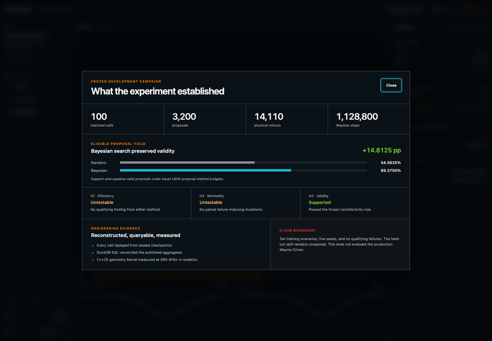
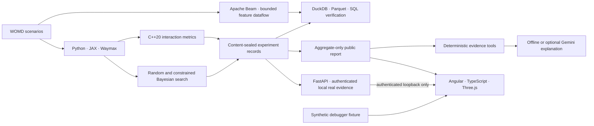

# PlanMargin

**Counterfactual stress testing for autonomous-driving planners.**

<!-- prettier-ignore -->
[](https://github.com/ethanvillalovoz/planmargin/actions/workflows/ci.yml)   [](LICENSE)

PlanMargin is a local, reproducible research workbench that searches for the
smallest realistic change to a recorded driving scenario that exposes an
avoidable planner failure. It combines Waymo Open Motion Dataset (WOMD)
scenarios, Waymax closed-loop simulation, constrained Bayesian optimization,
sealed experiment records, verified analytics, a measured native kernel, an
authenticated local evidence API, and an interactive evidence debugger.

## Version-one evidence

| Evidence                  |                                              Result |
| ------------------------- | --------------------------------------------------: |
| Matched experiment        |                         100 cells · 3,200 proposals |
| Simulation cost           |   14,110 physical rollouts · 1,128,800 Waymax steps |
| Qualifying findings       |                               0 random · 0 Bayesian |
| Eligible-proposal yield   |                 54.5625% random · 69.3750% Bayesian |
| Hypothesis decisions      |                     H1/H2 untestable · H3 supported |
| Native interaction kernel | 585–619× faster than the Python oracle in isolation |

The result is intentionally narrow. Constrained Bayesian search increased the
support-and-pipeline-valid rate by **14.8125 percentage points**, but neither
method found a qualifying failure under the frozen budget. The experiment does
not establish better failure discovery or mutation minimality. No held-out
comparative campaign ran; one validation record had already been accessed by a
legacy compatibility smoke test. PlanMargin does not evaluate the production
Waymo Driver. See the [aggregate-only result](docs/natural-development-results.md)
and [held-out decision](docs/decisions/0003-version-one-heldout-no-go.md).

> **Program status:** The recovered PlanMargin program is complete. The
> localhost-only real-record API and
> debugger mode, Beam-to-Parquet-to-DuckDB pipeline, and constrained evidence
> assistant are complete. The exact-scenario LiDAR Gaussian study produced a
> reproducible `no_go` because only 23.66% of the full debugger trajectories fit
> its frozen crop. The JAX double-DQN study also produced a reproducible
> `no_go`: 3.125% synthetic collisions exceeded its frozen 1.0% gate. Neither
> failed technology was forced into the product, and no held-out comparative
> campaign ran. See the
> [recovery decision](docs/decisions/0004-recover-original-program.md).



## What I built

PlanMargin is one end-to-end system rather than a collection of disconnected
technology demos:

- **Research design:** predeclared hypotheses, equal method budgets, immutable
  decision gates, and an explicit negative-result policy.
- **Simulation and evaluation:** deterministic WOMD/Waymax replay, bounded
  lead-braking mutations, tested/reference controller comparison, and a
  reproducible qualifying-finding contract.
- **Optimization:** a stateless uniform-random control and constrained
  multi-objective qLogNEHVI search in PyTorch/BoTorch.
- **Data engineering:** content-sealed checkpoints, atomic resumability,
  Apache Beam keyed transforms, deterministic partitioned Parquet,
  privacy-preserving DuckDB tables, and SQL reconciliation against the
  published aggregates and feature rows.
- **Local evidence service:** a token-authenticated, loopback-only FastAPI
  boundary over verified DuckDB/Parquet, sealed proposal records, and redacted
  real trajectories; no client-supplied SQL or paths.
- **Systems work:** a C++20/pybind11 interaction-metrics kernel selected by
  profiling and protected by randomized parity tests against the Python oracle.
- **Product engineering:** a responsive Angular/TypeScript/Three.js debugger
  with strict synthetic-input validation, an authenticated real-record mode,
  sealed proposal inspection, and an aggregate campaign view.
- **Constrained AI:** an offline-first evidence assistant with five
  deterministic aggregate tools, sealed citations, and an optional
  public-aggregate-only Gemini structured-output adapter.
- **Learned control research:** a deterministic JAX/Optax double-DQN training,
  evaluation, and tamper-evident checkpoint pipeline whose failed safety gate
  correctly prevented Waymax deployment and a held-out campaign.
- **Reliability:** locked Python and Node environments, versioned JSON Schemas,
  data-free CI, deterministic reconstruction, and repository privacy tests.

## Five-minute technical review

1. **Inspect the result.** Read the
   [aggregate campaign report](docs/natural-development-results.md) and its
   explicit claim boundary.
2. **Try the evidence debugger.** Follow the
   [local debugger instructions](#run-the-evidence-debugger), select
   `Proposal 02`, and open **Campaign results**.
3. **Trace the system.** Review the
   [implemented architecture](docs/architecture.md) and
   [sealed campaign coordinator](docs/matched-search-campaign.md).
4. **Check the engineering depth.** Review the
   [DuckDB/Parquet reconciliation](docs/analytics.md), the
   [constrained evidence assistant](docs/evidence-assistant.md), the
   [C++20 benchmark](docs/native-geometry.md), and the
   [v1 held-out `no_go`](docs/decisions/0003-version-one-heldout-no-go.md),
   [Gaussian feasibility result](docs/decisions/0005-gaussian-visualization-feasibility.md),
   and [v2 RL gate](docs/decisions/0006-experiment-v2-protocol.md).

## Research question

> Can realism-constrained Bayesian search find avoidable, policy-specific
> failures in recorded driving scenarios using fewer simulations than uniform
> random search?

A mutation counts as a finding only when the original tested controller
passes, the mutation clears physical, map, and empirical-behavior gates, the
tested controller fails or crosses the frozen risk threshold, the conservative
technical reference succeeds under the same mutation, and deterministic reruns
agree. This prevents the optimizer from “winning” with an impossible or
inevitable event.

Version one tested a two-dimensional lead-vehicle-braking family: braking-onset
offset and speed multiplier. Both methods received the same 1,600-proposal
budget across ten training scenarios and five seeds. The frozen
headway-regression alternative failed its predeclared eligibility gate, so it
was not substituted after the natural experiment produced no failures.

## Implemented architecture



Raw WOMD data, scenario identities, trajectories, feature vectors, support
scores, cell reports, and proposal records remain local and ignored. Only
schemas, code, synthetic fixtures, methodology, and permitted campaign-level
aggregates enter Git. The [architecture document](docs/architecture.md)
describes each responsibility and public/private boundary.

The implemented stack is Python, JAX/Waymax, PyTorch/BoTorch,
C++20/pybind11, Apache Beam, DuckDB, Parquet, FastAPI, Angular, TypeScript,
Three.js, an optional Gemini adapter, and GitHub Actions. The Gaussian and
learned-controller studies are complete as audited negative engineering
results. Hosted infrastructure is not required.

## Ask the evidence assistant

The default path is deterministic and offline:

```bash
uv run --frozen planmargin-ask-evidence \
  --question "How did Bayesian compare with random search?"
```

It maps the question to one closed aggregate query, emits cited facts, and
keeps explanation separate from measurement. An optional Gemini adapter can
explain only already-public aggregates; it never receives the raw question or
private records and requires explicit free-tier confirmation. See the
[assistant contract](docs/evidence-assistant.md).

## Run the Beam feature pipeline

Transform the validated private v1 feature checkpoints into deterministic
partitioned Parquet and a reconciled DuckDB database without rereading WOMD:

```bash
uv run --frozen planmargin-build-beam-features \
  --source-mode sealed-support \
  --support-dir artifacts/realism/lead-braking-support-v1 \
  --output-dir artifacts/beam-features/lead-braking-v1
```

The pipeline resumes sealed per-source-shard checkpoints, assigns eight stable
hash partitions with Beam `GroupByKey`, and verifies row identity and privacy
again in DuckDB. See the [Beam feature pipeline contract](docs/beam-feature-pipeline.md).

## Run the local evidence API

If the ignored real experiment artifacts exist locally, start the
token-authenticated service with:

```bash
uv run --frozen planmargin-serve-evidence
```

It binds only to `127.0.0.1:8765`, verifies the campaign, analytical database,
and rollout collection before serving, and prints an ephemeral local token.
See the [real-record API contract](docs/evidence-api.md) for its fixed endpoints
and privacy boundary. The debugger intentionally starts in synthetic mode.
Choose **Connect local evidence**, paste the ephemeral terminal token, and
connect to switch the workbench to ignored, verified local records. This also
enables the bounded Evidence Assistant and authenticated Gaussian Field.

Offline assistant explanations are the default and require no account. To use
the optional Gemini explanation adapter, set `GEMINI_API_KEY` and explicitly
confirm the free-tier boundary:

```bash
uv run --frozen planmargin-serve-evidence \
  --assistant-provider gemini \
  --confirm-gemini-free-tier
```

Gemini receives only the allowlisted public aggregate packet; it never receives
the raw question or ignored local evidence.

## Run the evidence debugger

The debugger boots with a bundled synthetic fixture and never uploads WOMD
records. With Node.js 24.15.0 or a compatible Node 24 release:

```bash
cd web/debugger
npm ci
npm start
```

Open `http://127.0.0.1:4200`. Use `?evidence=1` to open the campaign view
directly. The overview explains the evidence path; Scenario Lab supports
proposal selection, playback, timeline scrubbing, responsive
Scene/Evidence/Metrics views, validated synthetic JSON imports, and compact
synthetic-view export. When the local evidence API is running, the workbench
also exposes a campaign-cell browser, sealed proposal details, redacted real
trajectories, five bounded assistant questions with citations, and an
interactive local 75,000-primitive Gaussian field with its frozen integration
gate. Real-record and Gaussian export remain disabled.

Validate the frontend independently with:

```bash
npm run check
npm audit --audit-level=moderate
```

## Run the data-free checks

Install [uv](https://docs.astral.sh/uv/) and a C++20 compiler, then run:

```bash
uv sync --frozen
uv run --frozen ruff check .
uv run --frozen pytest
uv build
```

These checks compile the native extension and exercise the search, records,
analytics, geometry parity, and privacy contracts without WOMD credentials.
Dataset-backed reproduction requires accepting the applicable Waymo terms and
following the [credential-safe setup guide](docs/setup.md).

## Repository map

| Path                               | Responsibility                                                        |
| ---------------------------------- | --------------------------------------------------------------------- |
| [`src/planmargin`](src/planmargin) | Simulation, search, dataflow, evidence API, assistant, and analytics   |
| [`cpp`](cpp)                       | Measured C++20 interaction-metrics kernel                             |
| [`schemas`](schemas)               | Versioned experiment and analytics contracts                          |
| [`tests`](tests)                   | Data-free scientific, parity, reconstruction, and privacy checks      |
| [`web/debugger`](web/debugger)     | Angular/TypeScript/Three.js evidence debugger                         |
| [`docs`](docs)                     | Frozen protocols, decisions, results, and engineering evidence        |
| [`experiments`](experiments)       | Privacy-safe stage reports and implementation checkpoints             |

## Design decisions

- **Frozen contracts over post hoc tuning.** Thresholds, budgets, and
  hypothesis rules do not change in response to an observed method result.
- **Negative results are results.** Zero findings made H1 and H2 untestable;
  those outcomes were reported rather than converted into proxy wins.
- **Measured optimization only.** C++ owns one profiled geometry hotspot, and
  its 585–619× result is reported only as an isolated-kernel benchmark—not an
  end-to-end campaign speedup.
- **Technology must own a responsibility.** FastAPI owns the authenticated
  real-evidence boundary, and Beam owns restartable feature dataflow; every
  evaluated layer had to pass its own responsibility and verification gate
  before it could be claimed as a product capability.
- **Zero-cost execution.** The core system runs on local Apple silicon, CPU
  JAX, optional Colab Free, and data-free GitHub Actions.

## Documentation

| Area                     | Start here                                                                                                                                                                         |
| ------------------------ | ---------------------------------------------------------------------------------------------------------------------------------------------------------------------------------- |
| Product and architecture | [Project specification](docs/project-spec.md) · [Implemented architecture](docs/architecture.md) · [Version-one checkpoint](docs/decisions/0002-version-one-product-checkpoint.md) |
| Experiment contract      | [Behavioral realism and matched search](docs/behavioral-realism-and-matched-search.md) · [Campaign protocol](docs/matched-search-campaign.md)                                      |
| Final evidence           | [Aggregate result](docs/natural-development-results.md) · [Held-out decision](docs/decisions/0003-version-one-heldout-no-go.md)                                                    |
| Data and systems         | [Analytics](docs/analytics.md) · [Native geometry](docs/native-geometry.md) · [Rollout records](docs/rollout-record.md)                                                            |
| Dataflow                 | [Beam feature pipeline](docs/beam-feature-pipeline.md)                                                                                                                           |
| Evidence assistant       | [Constrained offline and Gemini contract](docs/evidence-assistant.md)                                                                                                            |
| Product interface        | [Local evidence API](docs/evidence-api.md) · [Debugger design](docs/debugger-design.md) · [Trajectory visualization](docs/trajectory-visualization.md)                               |
| Reproduction             | [Local setup](docs/setup.md) · [Data boundary](data/README.md)                                                                                                                     |
| Program audit            | [Original-program recovery](docs/decisions/0004-recover-original-program.md) · [Final integration audit](docs/final-program-audit.md)                                   |

## Data, licensing, and affiliation

PlanMargin is an independent project and is **not affiliated with, endorsed by,
or representative of Waymo LLC**. It does not evaluate the production Waymo
Driver.

Waymo Open Dataset and Waymax access are governed by their respective terms
and non-commercial-use conditions. Users are responsible for obtaining access
and accepting those terms. Raw data, credentials, and restricted artifacts
must never be committed here. See [data/README.md](data/README.md).

This software was made using the Waymo Open Dataset, provided by Waymo LLC
under the [Waymo Dataset License Agreement for Non-Commercial Use](https://waymo.com/open/terms/),
and access and use are governed by that agreement.

The original code in this repository is licensed under the
[Apache License 2.0](LICENSE). Third-party software and datasets retain their
own licenses.
