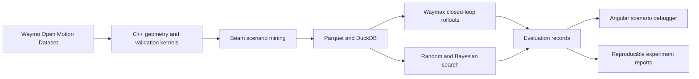

# PlanMargin

**Counterfactual stress testing for autonomous-driving planners.**

PlanMargin is an independent research and engineering project that searches for the smallest realistic change to a recorded driving scenario that exposes an avoidable planner failure.

> **Current status:** The deterministic 320-proposal uniform-random training
> baseline is complete. It retained every invalid attempt, reproduced every
> accepted rollout, and found no qualifying policy-specific failure. The
> version-one product checkpoint confirms that the experiment engine is on
> track, while empirical behavioral realism and the recruiter-facing product
> layers remain incomplete. The frozen WOMD empirical-support gate is now
> implemented and validated on 265 events from the exact 16-shard reference
> sample. The next milestone is the method-neutral, five-seed random/Bayesian
> development comparison. No planner-performance claims have been made.

## The problem

Autonomous-driving planners can perform well on average while remaining sensitive to small changes in difficult interactions. Randomly mutating scenarios wastes simulation time, and simply generating collisions is not useful: a collision may be physically implausible or unavoidable by any controller.

PlanMargin asks:

> Can realism-constrained Bayesian search find avoidable, policy-specific failures in recorded driving scenarios using fewer simulations than random search?

For example, consider an unprotected left turn that succeeds in the recorded data. If an oncoming vehicle arrives 0.6 seconds earlier:

- Does the tested planner still respond safely?
- Is the timing change physically and behaviorally plausible?
- Could a conservative reference controller avoid the event?
- What is the smallest change that crosses the planner's failure boundary?

## What counts as a finding?

A generated event is accepted only when all of the following are true:

1. The tested planner passes the original scenario.
2. The mutation is physically feasible and map-compliant.
3. The mutated behavior resembles motion observed in real data.
4. The tested planner fails or crosses a defined critical-risk threshold.
5. A conservative reference controller succeeds under the identical mutation.
6. The outcome is reproducible.

This prevents the search process from “winning” by creating impossible or inevitable crashes.

## Initial experiment

The first experiment will use a deliberately narrow scope:

- **Data:** Waymo Open Motion Dataset (WOMD)
- **Simulator:** Waymax
- **Scenario family:** lead-vehicle braking, selected after the bounded unprotected-left-turn probe triggered the feasibility fallback
- **Mutations:** braking-onset offset and speed multiplier for the lead vehicle
- **Baseline:** uniform random search
- **Proposed method:** constrained Bayesian optimization
- **Primary metrics:** valid failure discovery rate, simulations to first valid failure, minimum mutation distance, realism pass rate, and reference-controller avoidability rate

The comparison will use equal rollout budgets and held-out scenarios.

## Planned architecture

Planned technologies include C++20, Python, JAX/Waymax, PyTorch/BoTorch, Apache Beam, Arrow/Parquet, DuckDB, Angular, TypeScript, Three.js, FastAPI, Docker, and GitHub Actions. Each technology will be added only when it owns a real system responsibility.

## Zero-cost design constraint

The core project must run without purchasing compute or hosted infrastructure.

- Local preprocessing, C++, SQL, visualization, and small-model work run on an Apple-silicon Mac.
- JAX/Waymax runs locally on CPU or opportunistically on Colab Free.
- PyTorch MPS is the fallback for learned components.
- Every remote job must be sharded, checkpointed, and resumable.
- No milestone may depend on receiving a particular Colab GPU.

## Roadmap

- [x] Validate credential-safe WOMD access and replay one scenario twice
- [x] Select and replay ten WOMD interaction scenarios in Waymax
- [x] Apply one bounded speed or timing mutation
- [x] Run tested and reference controllers
- [x] Export trajectories and evaluation metrics
- [x] Produce the first original-versus-counterfactual visualization
- [x] Validate the initial scenario family
- [x] Implement random-search baseline
- [x] Freeze the version-one product checkpoint
- [x] Resolve the behavioral-realism contract and freeze matched search
- [x] Implement the WOMD empirical-support gate
- [ ] Implement constrained Bayesian search
- [ ] Build the thin interactive scenario-debugger slice
- [ ] Run equal-budget evaluation on held-out scenarios
- [ ] Add the analytical data layer and measured systems optimization
- [ ] Polish the reproducible recruiter-facing demonstration

See the [local setup guide](docs/setup.md),
[scenario-selection protocol](docs/scenario-selection.md),
[speed-mutation protocol](docs/speed-mutation.md),
[controller-comparison protocol](docs/controller-comparison.md),
[rollout-record protocol](docs/rollout-record.md),
[trajectory-visualization protocol](docs/trajectory-visualization.md),
[lead-braking family-validation protocol](docs/family-validation.md),
[deterministic random-search protocol](docs/random-search.md),
[WOMD empirical-support and matched-search protocol](docs/behavioral-realism-and-matched-search.md),
[WOMD empirical-support implementation](docs/empirical-support.md),
[project specification](docs/project-spec.md),
[architecture](docs/architecture.md), and
[initial scope decision](docs/decisions/0001-project-scope.md), and
[version-one product checkpoint](docs/decisions/0002-version-one-product-checkpoint.md)
for details.

## Reproducibility principles

- Every local rollout result must retain its scenario ID, code revision,
  configuration, seed, and metric definitions.
- Raw and per-scenario derived Waymo data will not be committed. Public reports
  contain only permitted aggregate results and data-free methodology.
- Tiny synthetic fixtures will test geometry and evaluation behavior without requiring dataset access.
- Unsuccessful experiments will be documented when they change the project direction.
- Results will be reported with limitations rather than converted into unsupported safety claims.

## Data, licensing, and affiliation

PlanMargin is an independent project and is **not affiliated with, endorsed by, or representative of Waymo LLC**. It does not evaluate the production Waymo Driver.

Waymo Open Dataset and Waymax access are governed by their respective terms and non-commercial-use conditions. Users are responsible for obtaining access and accepting those terms. Raw data, credentials, and restricted artifacts must never be committed here. See [data/README.md](data/README.md).

This software was made using the Waymo Open Dataset, provided by Waymo LLC
under the [Waymo Dataset License Agreement for Non-Commercial Use](https://waymo.com/open/terms/),
and access and use are governed by that agreement.

The original code in this repository is licensed under the Apache License 2.0. Third-party software and datasets retain their own licenses.
