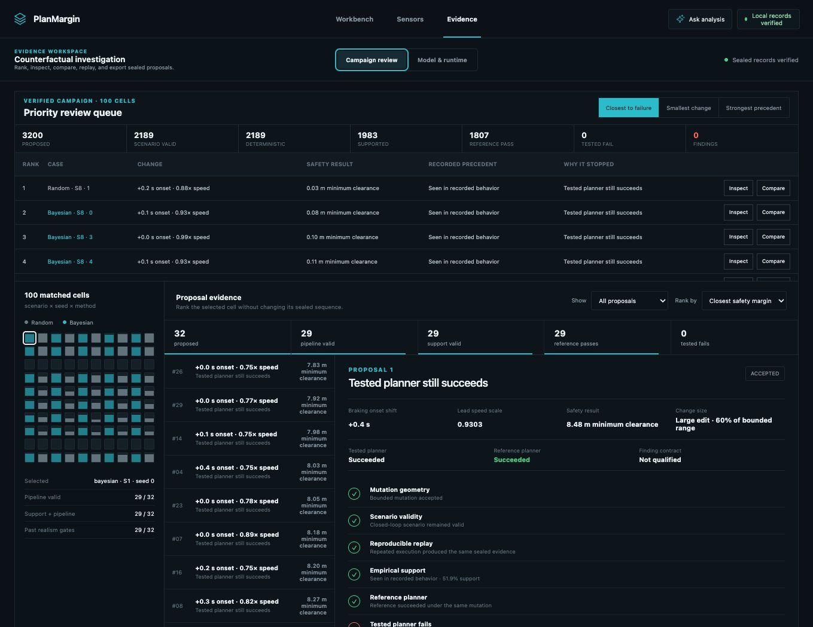
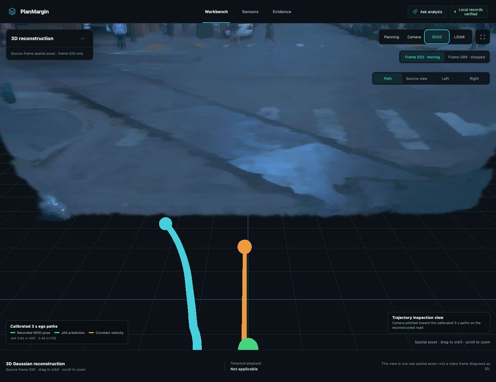
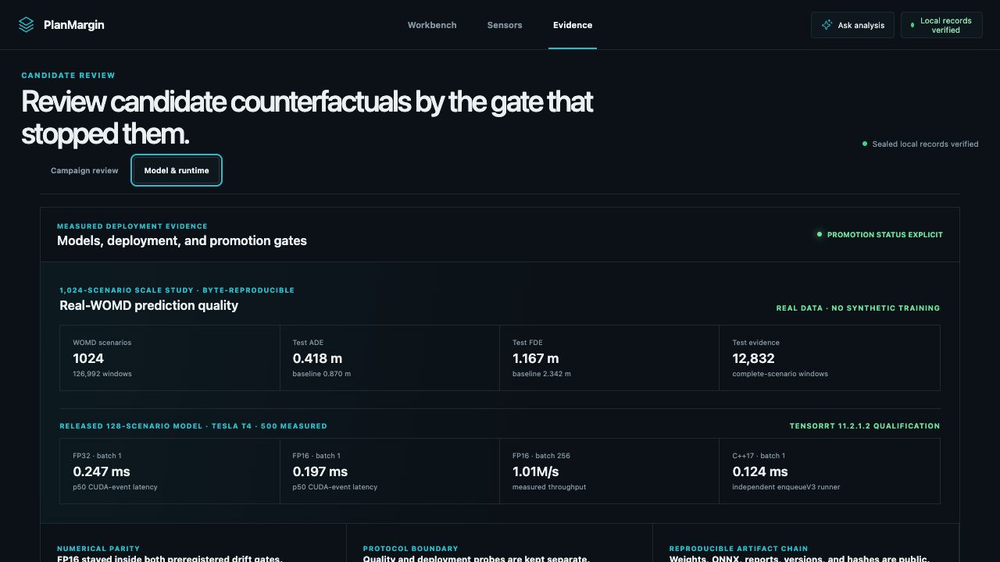
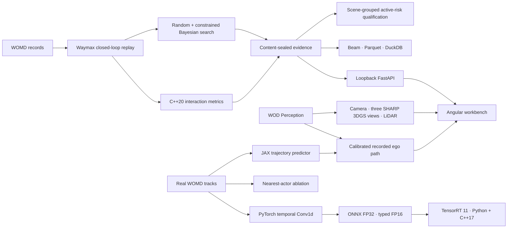

# PlanMargin

**Find realistic scenario changes that isolate planner regressions.**

<!-- prettier-ignore -->
[](https://github.com/ethanvillalovoz/planmargin/actions/workflows/ci.yml)     [](LICENSE)

PlanMargin turns a recorded driving scenario into a reviewable counterfactual:
change lead-vehicle behavior, replay the tested and reference planners under the
same conditions, and keep only cases that are realistic, reproducible, and
specific to the tested planner.

It is an engineering workbench, not a benchmark leaderboard or a Waymo Driver
evaluation.



The public clone opens a useful aggregate analysis surface over the sealed
3,200-proposal campaign. It fails closed only for licensed per-scenario data. An
authorized local launch adds exact proposal replay, candidate investigation,
recorded camera annotations, LiDAR, three 3D Gaussian reconstructions, and a
calibrated real-data JAX trajectory overlay without uploading those artifacts.
The public Evidence view exposes the 1,024-scenario real-WOMD prediction study,
both free-T4 TensorRT decisions, and every promotion gate—including learned and
reduced-precision ideas that were stopped because the evidence did not support
deployment.

## The engineering workflow

1. **Search** bounded scenario changes with matched random and constrained
   Bayesian budgets.
2. **Reject** physically invalid, unsupported, or non-reproducible candidates.
3. **Isolate** a regression only when the tested planner fails and the reference
   planner succeeds under the same change.
4. **Inspect** the decision in a local workbench with planning replay, camera
   annotations, LiDAR, 3D Gaussian reconstruction, and sealed evidence.

The public interface opens on aggregate Evidence. An authenticated local launch
opens the scene debugger with the retained records already loaded. Scores are
paired with plain language such as **tested planner still succeeds**, **outside
recorded behavior**, and **reference planner failed**.

Inside the authenticated Evidence workspace, the priority queue, campaign gate
counts, 100-cell search matrix, ranked proposals, selected-candidate gate
ladder, comparison, exact replay, grounded analysis, and signed export remain
visible as one investigation console. The interface is designed for tracing a
decision, not presenting a marketing dashboard.



## Run it

### Inspect the public application

The public application contains no fabricated scenario stream:

Node 24.15 and npm 11 are required. The repository includes an `.nvmrc`; with
`nvm` installed, select the tested runtime before installing dependencies:

```bash
git clone https://github.com/ethanvillalovoz/planmargin.git
cd planmargin
nvm install
nvm use
cd web/debugger
npm ci
npm start
```

Open `http://127.0.0.1:4200`. Evidence provides the real aggregate campaign
dashboard immediately. Workbench and Sensors explain exactly which licensed
local capabilities become available after an authenticated launch.

There is intentionally no hosted dashboard in this release: the public bundle
is aggregate-only, while the useful per-scenario surfaces depend on licensed
records that must stay on the engineer's machine. The commands above are the
supported public entry point.

### Open the complete local workbench

Python 3.11, [uv](https://docs.astral.sh/uv/), Node 24.15, and a C++20 compiler
are required. The tested development platforms are current macOS on Apple
silicon and Ubuntu Linux on x86-64; CI is the source of truth for the Linux
contract:

```bash
uv sync --frozen
cd web/debugger && npm ci && cd ../..
uv run --frozen planmargin-doctor --require full
uv run --frozen planmargin-workbench
```

The lock deliberately excludes PyTorch's optional Triton compiler backend.
PlanMargin uses eager PyTorch execution and does not call `torch.compile`; the
exclusion keeps the documented locked install identical to the environment
tested by Linux CI.

The launcher starts the loopback-only API and the Angular application, opens an
authenticated ephemeral URL, exchanges its token for an HttpOnly same-site
browser-session cookie, and removes the token from the address bar. Refreshes
and additional local tabs reconnect automatically; disconnecting or closing the
browser session clears access. There is no token-copy step and JavaScript cannot
read the session credential. Private responses use `Cache-Control: no-store`,
and source identifiers never enter the UI.

To enable Gemini explanations in that same workbench while keeping the Google
project on its free tier:

```bash
uv sync --frozen --extra assistant
export GEMINI_API_KEY="..."
uv run --frozen --extra assistant planmargin-workbench \
  --assistant-provider gemini \
  --confirm-gemini-free-tier
```

Do not attach billing to the AI Studio project if a hard zero-cost boundary is
required. After an explicit question, the adapter makes at most three bounded
hosted attempts (six seconds each) when the provider returns malformed or
uncitable structured output. It sends public aggregate facts rather than local
scenario records. Exhausted attempts fall back to the labeled, verified
deterministic explanation. See the
[provider contract](docs/evidence-assistant.md).

If the doctor reports missing licensed artifacts, use the
[workspace reproduction runbook](docs/reproducing-the-workspace.md). For the
complete planning, camera, LiDAR, 3DGS, Beam, JAX, and PyTorch workspace, an
authorized Waymo Open Dataset account can run one resumable command:

```bash
uv run --frozen planmargin-bootstrap-workbench --accept-waymo-terms
```

Use `--device mps`, `--device cuda`, or `--device cpu` to require a backend.
The bootstrap installs the locked frontend, verifies authorized access, resumes
each deterministic evidence phase, downloads only pinned inputs, and finishes
with `planmargin-doctor --require full`. It requires real compute time but no
paid compute.

## What the workbench verifies

Every candidate passes through independent gates; PlanMargin never compresses
them into one unexplained score:

| Gate                 | Engineer-facing question                                         |
| -------------------- | ---------------------------------------------------------------- |
| Scenario geometry    | Is the proposed edit physically and map consistent?              |
| Closed-loop validity | Did the mutated scenario remain valid during replay?             |
| Recorded support     | Does comparable behavior exist in the recorded development data? |
| Reproducibility      | Did repeated executions produce identical evidence?              |
| Reference outcome    | Did the conservative control planner remain successful?          |
| Tested outcome       | Did the planner under test actually fail?                        |

Only a candidate that passes all six gates is a planner-specific regression.

## Current evidence, stated without spin

The immutable v1 development campaign evaluated 3,200 proposals across 100
matched cells. It found no qualifying planner regression. Constrained Bayesian
search produced a higher share of support-and-pipeline-valid proposals than
uniform random search, but failure-discovery efficiency and failure minimality
remain untestable because neither method found a qualifying failure. No
validation-backed comparison was opened after that no-go.

The original Stage-0 planning replay is authentic but separate from the
campaign. PlanMargin now also retains ten separately versioned replays: five
priority cases plus five additional low-margin proposals from distinct scenario
orders. Each was re-executed from its authorized WOMD source, and its
tested/reference trajectory hashes, outcomes, interaction metrics, scenario
validation, and repeated executions match the sealed v1 proposal. The other
proposal records remain hash-and-metric evidence unless they are deliberately
re-executed through the same verifier.

The WOD Perception camera and LiDAR remain separate from the WOMD/Waymax
counterfactual experiment. The Sensor Lab now contains SHARP reconstructions
for moving frame 20, approach frame 60, and stopped frame 99. At frame 20 it registers the recorded
three-second ego path, a real-WOMD-trained JAX prediction, and a constant-
velocity baseline into the SHARP source-camera coordinate system. The model is
held out by scenario and meets its absolute visualization error gates, but does
not beat constant velocity on its test scenario; the UI and report state that
negative comparison rather than claiming model superiority.

The deployable Conv1d track now covers 126,992 windows from 1,024 real WOMD
scenarios with complete-scenario train/validation/test separation. On 12,832
test windows it achieved 0.418 m ADE and 1.167 m FDE, compared with 0.870 m and
2.342 m for constant velocity. A clean repeat produced byte-identical weights
and ONNX. Its hash-pinned
[model-only release](https://github.com/ethanvillalovoz/planmargin/releases/tag/trajectory-model-v2)
contains no WOMD records.

Two Version 2 hypotheses did not pass their frozen gates. A five-model active-
risk ensemble trained on 2,097 real campaign targets reached mean held-out
Spearman 0.137 and beat matched random selection at budget eight in only 3 of 9
scenes, so no learned selector was promoted. An interaction model pooling eight
nearest actors reached 0.453 m ADE versus 0.434 m for its same-data ego-only
ablation, so it was also stopped rather than packaged.

The scaled ONNX graph was measured on a free Tesla T4 with TensorRT 11.2.1.2.
FP32 batch-1 end-to-end p50 was 0.277 ms and the independently compiled C++17
runner measured 0.153 ms. FP16 batch-1 end-to-end p50 was 0.393 ms and batch-256
throughput was 0.975M samples/s. FP16 RMSE passed at 0.0065 m, but its 0.101 m
maximum drift exceeded the frozen 0.075 m limit, so FP16 promotion is a measured
no-go. The earlier 128-scenario model retains its separate qualified result;
those values are never attributed to the scaled model.

Version 3 preregistered two bounded follow-ups. A residual-only FP16 graph
keeps smoothing and composition in host FP32; its unchanged physical probe
passed locally on Apple MPS at 0.046 m maximum error and 0.0048 m RMSE, but it
has not run on TensorRT and is not promoted. A deterministically trained DQN
with a frozen longitudinal safety envelope reduced the synthetic collision
rate to 2.686%, but missed its 1% gate and was stopped before any real-WOMD
campaign. Aggregate records preserve both results without shipping models or
licensed examples.



| Version 2 decision                     | Evidence                                                                          | Promotion                     |
| -------------------------------------- | --------------------------------------------------------------------------------- | ----------------------------- |
| Scale the deployable predictor         | 1,024 real scenes; model beats constant velocity; byte-identical repeat           | Model-only release candidate  |
| Learn which counterfactual to test     | 2,097 targets; weak scene-held-out ranking and 3/9 budget wins                    | Stopped                       |
| Add nearest-actor context              | Same 102-scene test split; worse than ego-only                                    | Stopped                       |
| Qualify the scaled ONNX on NVIDIA      | Free-T4 Python + C++17 run; FP32 and latency gates passed; FP16 max drift 0.101 m | FP16 stopped; FP32 measured   |
| Re-architect the FP16 graph            | Residual-only MPS proxy passed unchanged drift gates                              | TensorRT measurement required |
| Add a shield to the learned controller | Deterministic 2,048-episode synthetic qualification; 2.686% collisions            | Stopped at frozen 1% gate     |

Read the [aggregate result](docs/natural-development-results.md) and
[held-out decision](docs/decisions/0003-version-one-heldout-no-go.md) for the
frozen claim boundary.

## System architecture



| Responsibility    | Implementation                       | Verification                                                    |
| ----------------- | ------------------------------------ | --------------------------------------------------------------- |
| Simulation        | Python, JAX, Waymax                  | fixed scenario contracts and deterministic reruns               |
| Search            | PyTorch, BoTorch qLogNEHVI           | equal budgets, five seeds, frozen gates                         |
| Native metrics    | C++20, pybind11                      | randomized Python-oracle parity                                 |
| Dataflow          | Apache Beam, Parquet, DuckDB         | stable partitions and SQL reconciliation                        |
| Evidence service  | FastAPI                              | loopback auth, closed response models, path confinement         |
| Product           | Angular, TypeScript, Three.js, Spark | strict types, component tests, production build                 |
| Reconstruction    | Apple SHARP                          | pinned source, model hash, MPS/CUDA/CPU execution               |
| Trajectory model  | JAX, Optax, real WOMD tracks         | scenario holdout, baseline comparison, sealed checkpoint        |
| Deployable model  | PyTorch, ONNX, TensorRT 11           | 1,024-scenario holdout, constant-velocity baseline, byte repeat |
| Learned mining    | PyTorch ensemble, grouped CV         | rank, budgeted selection, calibration, and no-go gates          |
| Interaction study | PyTorch nearest-actor pooling        | same-data ego-only ablation and no-go gate                      |
| NVIDIA runtime    | Python and C++17 `enqueueV3`         | device plus pinned-host end-to-end p50/p95/p99 contract         |
| Assistant         | deterministic tools, optional Gemini | allowlisted evidence and sealed citations                       |
| Replay retention  | Python, JAX, Waymax                  | proposal seal, trajectory-hash and metric matching              |

## Data and distribution boundary

PlanMargin separates public code and aggregate results from licensed local
evidence:

The tracked [PlanMargin public evidence bundle](release/huggingface/planmargin-public-evidence)
contains sixteen manifest-verified aggregate records and no scene-level WOD
files. Building or running PlanMargin does not publish this staged bundle.

| Surface                               | Public clone      | Authorized local workspace                   |
| ------------------------------------- | ----------------- | -------------------------------------------- |
| Source, schemas, tests, architecture  | Included          | Included                                     |
| Aggregate experiment decision         | Included          | Included                                     |
| Model-only PyTorch and ONNX artifacts | Versioned release | Versioned release                            |
| TensorRT latency and parity report    | Included          | Included                                     |
| TensorRT engine binaries              | Rebuilt per GPU   | Rebuilt per GPU                              |
| Per-proposal records and exact gates  | Not redistributed | Seal-verified locally                        |
| Planning and proposal-linked replays  | Not redistributed | Seal- and hash-verified locally              |
| Camera, annotations, LiDAR, and 3DGS  | Not redistributed | Seal-verified locally                        |
| Deterministic evidence assistant      | Aggregate scope   | Local evidence scope                         |
| Gemini explanation                    | Optional          | User key and explicit free-tier confirmation |

This is a licensing boundary, not a synthetic-data fallback.

To retain another accepted proposal locally, use its one-based campaign
identity:

```bash
uv run --frozen planmargin-retain-proposal-replay \\
  --method random \\
  --seed 1 \\
  --selection-order 8 \\
  --proposal-number 12
```

The command refuses rejected proposals and existing outputs. It publishes
nothing: the resulting package stays under the ignored
`artifacts/proposal-replays/` boundary.

## Verify the repository

```bash
uv run --frozen ruff check .
uv run --frozen pytest
uv build
cd web/debugger && npm run check
```

CI also audits the complete locked Python environment with `pip-audit`. Five
temporarily accepted Apache Beam transitive advisories are explicit, versioned
exceptions; every other advisory fails CI. Their reachability analysis and
removal conditions are recorded in the
[dependency security policy](docs/dependency-security.md).

To reproduce the NVIDIA deployment result without downloading WOMD records,
open [`notebooks/planmargin_tensorrt_colab.ipynb`](notebooks/planmargin_tensorrt_colab.ipynb)
in a free T4 Colab runtime. It downloads and verifies the model-only release,
builds FP32 and typed-FP16 engines, runs 50 warmups plus 500 measured iterations
at batches 1, 8, and 256, and compiles the C++17 cross-check. The notebook uses
the scaled `trajectory-model-v2` release and labels its output independently
from the earlier published TensorRT result.

`uv run --frozen planmargin-doctor` reports exactly which public and authorized
artifacts are present instead of silently degrading the product.

## Repository map

| Path                                         | Responsibility                                                 |
| -------------------------------------------- | -------------------------------------------------------------- |
| [`src/planmargin`](src/planmargin)           | simulation, search, evidence API, assistant, readiness tooling |
| [`cpp`](cpp)                                 | C++20 metrics kernel and C++17 TensorRT runtime                |
| [`web/debugger`](web/debugger)               | Angular/TypeScript/Three.js/Spark workbench                    |
| [`schemas`](schemas)                         | versioned experiment and analytics contracts                   |
| [`tests`](tests)                             | data-free science, parity, API, privacy, and setup checks      |
| [`docs`](docs)                               | architecture, protocols, decisions, results, and runbooks      |
| [`release/huggingface`](release/huggingface) | aggregate-only package; no WOD scene files                     |

Start with the [PlanMargin 3.0.1 release notes](docs/release-3.0.1.md),
[final program audit](docs/final-program-audit.md),
[using the workbench](docs/using-the-workbench.md), the
[architecture](docs/architecture.md),
[workspace reproduction](docs/reproducing-the-workspace.md),
[evidence API](docs/evidence-api.md), and [contribution guide](CONTRIBUTING.md).
Security reports follow the [security policy](SECURITY.md).

## License and affiliation

PlanMargin is independent and is **not affiliated with, endorsed by, or
representative of Waymo LLC**. It does not evaluate the production Waymo
Driver.

This software was made using the Waymo Open Dataset, provided by Waymo LLC
under the [Waymo Dataset License Agreement for Non-Commercial Use](https://waymo.com/open/terms/).
WOD source data and restricted per-scenario derivatives are not included in
this repository.

Original PlanMargin code is licensed under [Apache License 2.0](LICENSE).
Dataset terms, model terms, and third-party licenses remain separate; see
[NOTICE](NOTICE).
