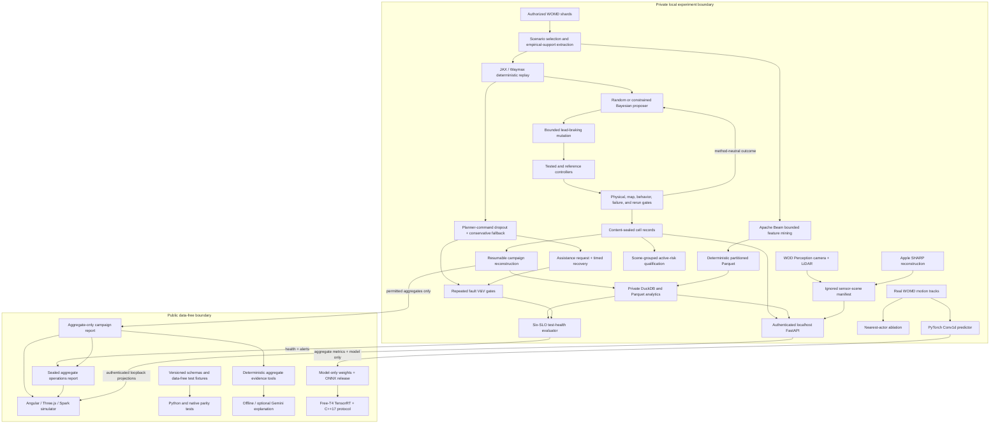

# Implemented PlanMargin architecture

PlanMargin is a local counterfactual stress-testing workbench with two strict
boundaries: deterministic code owns scientific decisions, and restricted WOMD
records never enter the public repository. Experiment v1 is complete at this
boundary. Later tracks add separately gated prediction, active-mining,
interaction, deployment, test-health, and fault-protection responsibilities
without changing that frozen scientific result.

## System flow

## Component responsibilities

| Layer                     | Implementation                       | Responsibility                                                                                                                                                               |
| ------------------------- | ------------------------------------ | ---------------------------------------------------------------------------------------------------------------------------------------------------------------------------- |
| Dataset adapter           | Python, TensorFlow records, WOMD     | Stream authorized shards, retain source identity privately, and normalize scenario inputs.                                                                                   |
| Simulation                | JAX, Waymax                          | Deterministic original and counterfactual closed-loop rollouts.                                                                                                              |
| Mutation                  | Python                               | Apply bounded braking-onset and speed changes while retaining the recorded spatial route.                                                                                    |
| Controllers               | Waymax IDM configurations            | Compare a tested technical controller with a conservative technical reference under the identical mutation.                                                                  |
| Validation                | Python plus C++20/pybind11           | Enforce initial, physical, map, empirical-support, failure, reference-success, and rerun gates; accelerate one profiled interaction-metrics kernel.                          |
| Search                    | NumPy PCG64, PyTorch, BoTorch        | Produce stateless uniform-random proposals or constrained multi-objective qLogNEHVI proposals under matched budgets.                                                         |
| Coordination              | Python, JSON Schema                  | Preserve every attempted proposal, account for physical rollout cost, seal checkpoints, and resume without changing decisions.                                               |
| Analytics                 | DuckDB, Parquet, SQL                 | Normalize sealed campaign summaries privately and independently reconcile published aggregates.                                                                              |
| Test health               | Python, JSON Schema                  | Evaluate seven owned SLOs, emit actionable root-cause alerts, and seal the aggregate operations contract.                                                                    |
| Fault protection          | JAX, Waymax                          | Inject sustained command dropout and verify deterministic unprotected and conservative-fallback responses on real WOMD scenes.                                               |
| Assistance V&V            | JAX, Waymax                          | Verify fault, request, fallback, deterministic resolution, and primary recovery as distinct observable states.                                                               |
| Feature dataflow          | Apache Beam, PyArrow, Parquet        | Mine or ingest bounded training shards, extract the shared behavior features, checkpoint by source, key/group into stable partitions, and reconcile in DuckDB.               |
| Sensor preparation        | Python, DuckDB, SciPy, SHARP         | Extract recorded camera frames, fit the same-frame LiDAR Gaussian field, and seal fixed ignored asset metadata without downloading or publishing data.                       |
| Local API                 | FastAPI, read-only DuckDB            | Verify ignored evidence at startup and expose token-authenticated, privacy-reduced evidence plus fixed sensor assets on loopback only.                                       |
| Evidence UI               | Angular, TypeScript, Three.js, Spark | Keep Camera and Planning on independent clocks; render calibrated SHARP 3DGS, same-frame LiDAR, sealed planning metrics, and bounded assistance without export.              |
| Evidence assistant        | Python, optional Gemini SDK          | Route questions to one closed aggregate tool, cite sealed deterministic facts, and optionally explain public aggregates without sharing the raw question or private records. |
| Deployable prediction     | PyTorch, ONNX                        | Train a compact temporal Conv1d model on complete-scenario real-WOMD splits and export a dynamic-batch graph.                                                                |
| Active-risk qualification | PyTorch ensemble                     | Rank sealed real outcomes under scenario-grouped cross-validation, calibration, random baselines, and frozen promotion gates.                                                |
| Interaction ablation      | PyTorch                              | Compare nearest-actor pooling against ego-only history on the identical real-data scenario split.                                                                            |
| NVIDIA qualification      | TensorRT 11, CUDA, C++17             | Measure parity plus device and pinned-host end-to-end latency without requiring WOMD records.                                                                                |
| Automation                | uv, npm, GitHub Actions              | Reproduce data-free lint, tests, native builds, dependency audit, typechecking, and frontend production builds.                                                              |

## Experiment execution

1. The selection stage identifies ten training scenarios and extracts a bounded
   empirical-support model from authorized WOMD training shards.
2. Each method receives the same scenario, seed, mutation bounds, controller
   parameters, proposal count, and validity contract.
3. The proposer selects a two-dimensional mutation. The method-neutral
   coordinator evaluates it through Waymax and retains accepted and rejected
   attempts in the audit trail.
4. A candidate is a qualifying finding only when the tested controller fails,
   the reference succeeds, every feasibility gate passes, and deterministic
   reruns agree.
5. Each cell is written atomically with content hashes. The campaign report is
   reconstructed from sealed cells rather than from a second in-memory result
   path.
6. The analytical builder validates those seals again, recreates method totals
   with SQL, reads back each Parquet table, and publishes only after all
   reconciliation checks agree.
7. Campaign-level aggregates cross the public boundary. Scenario identifiers,
   proposal records, trajectories, controller traces, feature vectors, support
   scores, and cell-level facts do not.
8. The test-health evaluator reconciles the campaign, analytics, replay, and
   fault-protection contracts into seven SLOs. Degraded fixtures verify that each
   failed objective produces an owned, actionable alert.

## Frozen scientific invariants

- Random and Bayesian search share proposal budgets, mutation bounds,
  controllers, physical-cost definitions, and validity gates.
- Rejected and invalid proposals remain part of the primary budget.
- The optimizer can propose a mutation but cannot certify a finding.
- No result is accepted without deterministic reconstruction from sealed
  records.
- Hypothesis rules are evaluated as frozen; budget-censored discovery values
  are not reported as observed costs.
- No held-out WOMD comparative campaign ran under the version-one `no_go`;
  a legacy compatibility smoke had accessed one validation record.

## Native geometry boundary

Profiling identified signed oriented-box separation as the bounded Python
hotspot inside continuous interaction metrics. C++20 owns the aligned
per-state geometry loop; Python retains schema validation and final rounding.
The original Python implementation remains the parity oracle.

On the development M4 Pro, the native path measured 585–619× faster than the
Python oracle for one deterministic 80-state synthetic trace. This is an
isolated-kernel result, not an end-to-end Waymax or campaign speedup. See the
[benchmark and parity contract](native-geometry.md).

## Analytical data boundary

The implemented analytical layer begins at sealed campaign and cell summaries.
It writes a private DuckDB database and Zstandard-compressed Parquet tables,
recomputes the published method metrics with SQL, and records reproducible
logical provenance. It intentionally does not duplicate raw dataset records,
proposal checkpoints, scenario identities, trajectories, or support vectors.
See the [analytics contract](analytics.md).

## Public and private artifacts

| Public and tracked                    | Private and ignored                       |
| ------------------------------------- | ----------------------------------------- |
| Source code and JSON Schemas          | Raw or cached WOMD shards                 |
| Synthetic fixtures and parity cases   | Scenario and object identifiers           |
| Frozen protocols and decision records | Original and mutated trajectories         |
| Campaign-level aggregate results      | Proposal and cell records                 |
| Aggregate model and no-go reports     | Per-scenario model windows and targets    |
| Model-only PyTorch and ONNX release   | Local training cache                      |
| Privacy-reviewed product screenshots  | Feature vectors and support scores        |
| UI code and data-free renderer tests  | Camera frames, SHARP PLY, and LiDAR PLY   |
| Data-free CI configuration            | DuckDB, Parquet, and checkpoint artifacts |

Repository policy tests and `.gitignore` enforce this separation. The debugger
ships no private data and does not upload local records.

## Version 2 promotion outcomes

- The 1,024-scenario temporal Conv1d model passed its real-data prediction and
  byte-reproducibility gates. It is a model-release candidate.
- The active-risk ensemble failed rank, budget-win, and calibration gates. No
  learned search selector was exported or used prospectively.
- The nearest-actor model underperformed its ego-only ablation. Its local model
  and ONNX were not promoted.
- The scaled model's NVIDIA protocol completed on a free T4. FP32 passed; FP16
  remains stopped because 0.101 m maximum drift exceeded the frozen 0.075 m
  gate. Metrics from the earlier 128-scenario model are never inherited.

The implemented local API can expose redacted real evidence only to an
authenticated process on the same machine. It is not a public-data boundary:
coordinates and proposal facts remain restricted even after identifiers are
removed. See the [local evidence API contract](evidence-api.md).

## Reopened program responsibilities

Experiment v1 did not require the following layers, but ADR 0004 restores them
as separately gated program responsibilities rather than silently omitted
dependencies:

- **Apache Beam:** bounded scenario mining and empirical feature extraction to
  deterministic partitioned Parquet under DirectRunner; implemented with
  durable source checkpoints, keyed grouping, explicit partitions, and DuckDB
  reconciliation.
- **FastAPI:** implemented as a localhost-only, read-only boundary over ignored
  sealed records and verified DuckDB/Parquet evidence; the Angular client uses
  its fixed authenticated projections without persistence or export.
- **Evidence assistant:** implemented with ten allowlisted aggregate-query
  tools, a deterministic offline default, sealed citations, and an optional
  public-only Gemini structured-output adapter; never metric generation,
  finding certification, or vehicle control.
- **3D Gaussian splatting:** the frozen exact-planning-scenario LiDAR study
  remains `no_go` on trajectory coverage. Separately, a real WOD Perception
  frame is reconstructed with Apple SHARP and rendered beside same-frame LiDAR
  in the authenticated local simulator. The UI states that this visual segment
  is not registered to or evidence for the planning experiment.
- **Learned or RL planner:** the experiment-v2 JAX double-DQN candidate passed
  determinism, compute, and progress gates but failed its predeclared synthetic
  collision gate. It was not deployed into Waymax and no v2 validation read ran.

Hosted infrastructure remains unnecessary: every core responsibility must
retain a free local or data-free execution path. See the
[original-program recovery decision](decisions/0004-recover-original-program.md).
