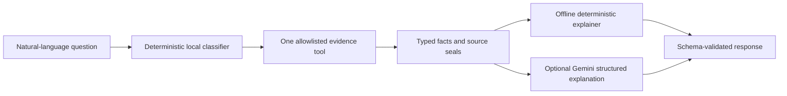

# Constrained evidence assistant

PlanMargin's evidence assistant answers a deliberately narrow set of questions
about already-computed aggregate evidence. Deterministic Python owns question
routing, tool selection, facts, values, citations, and claim boundaries. The
default explainer is offline and deterministic. An optional Gemini provider may
rewrite the interpretation, but it cannot select SQL, calculate a metric,
certify a finding, control a vehicle, or receive a private record.

## Execution contract



The classifier chooses exactly one of five query IDs:

| Query ID | Evidence responsibility |
| --- | --- |
| `campaign_overview` | Frozen v1 execution, cost, findings, and held-out state |
| `method_comparison` | Random/Bayesian aggregate validity, hypervolume, findings, and H3 status |
| `hypothesis_decisions` | Frozen H1, H2, and H3 decisions without reinterpreting censored values |
| `claim_boundary` | What the development result does and does not establish |
| `beam_pipeline` | Published Beam ingestion, event, partition, integrity, and privacy evidence |

Unknown questions fail closed. The question never becomes SQL, a filesystem
path, a model-selected function, or a network request. Public facts embed the
SHA-256 seals of their tracked source documents, and tests fail if those
sources drift without an explicit evidence update. Local mode reuses the
FastAPI evidence repository's startup verification and fixed read-only DuckDB
queries.

## Offline use

No credential, network, subscription, or hosted service is required:

```bash
uv run --frozen planmargin-ask-evidence \
  --question "How did Bayesian compare with random search?"
```

To query the ignored, sealed v1 aggregate database locally:

```bash
uv run --frozen planmargin-ask-evidence \
  --source local \
  --question "What happened to H1, H2, and H3?"
```

The JSON response follows
[`evidence-assistant-response-v1.schema.json`](../schemas/evidence-assistant-response-v1.schema.json).
It stores only a SHA-256 digest of the question, identifies the exact query,
lists deterministic facts separately from explanatory prose, cites source
seals, and declares its privacy boundary.

## Optional Gemini mode

Gemini is an explanation-only adapter over the **public aggregate** tool
result. It receives neither the raw question nor local DuckDB rows, campaign
records, trajectories, scenario IDs, paths, credentials, or private seals.
Structured output is validated with Pydantic, unknown fact citations are
rejected, numeric prose is rejected so the model cannot manufacture metrics,
and claim-certification phrases fail closed. The client makes one request and
does not retry automatically.

Google's current documentation identifies `google-genai` as its Python SDK and
supports JSON-Schema-constrained structured output through the Interactions
API. The SDK is pinned as an optional dependency rather than part of the core
runtime. See the official [SDK repository](https://github.com/googleapis/python-genai)
and [structured-output guide](https://ai.google.dev/gemini-api/docs/structured-output).

Google currently advertises free input and output for eligible free-tier
models, but rate limits depend on the active project and may change. More
importantly, Google states that free-tier content may be used to improve its
products. For those reasons hosted mode requires all of the following:

1. verify the active project is still on the Free tier in Google AI Studio;
2. create a key for that free-tier project and keep it only in the environment;
3. install the optional SDK; and
4. pass the explicit confirmation flag.

```bash
uv sync --extra assistant
export GEMINI_API_KEY="..."
uv run --extra assistant planmargin-ask-evidence \
  --provider gemini \
  --confirm-free-tier \
  --question "What is the defensible claim?"
```

The default pinned model is `gemini-3.1-flash-lite`; it can be changed with
`--model` after checking current availability. No request is made without both
the key and explicit confirmation. Hosted mode cannot be combined with
`--source local`. Consult Google's current [pricing](https://ai.google.dev/gemini-api/docs/pricing)
and [rate-limit](https://ai.google.dev/gemini-api/docs/rate-limits) pages before
use; PlanMargin never upgrades a project or enables billing.

## Verified boundary

Data-free tests cover all five routes, JSON Schema validation, source-seal
drift, unknown-query rejection, raw-question exclusion from the simulated
Gemini payload, public-only provider input, structured-output configuration,
free-tier confirmation, invalid citations, generated-number rejection, and
client closure. A private integration additionally executes the offline tool
against the sealed v1 DuckDB evidence. No hosted request is necessary for the
assistant to be useful or testable.

This layer explains experiment evidence; it does not change experiment v1 or
authorize experiment-v2 held-out access.
