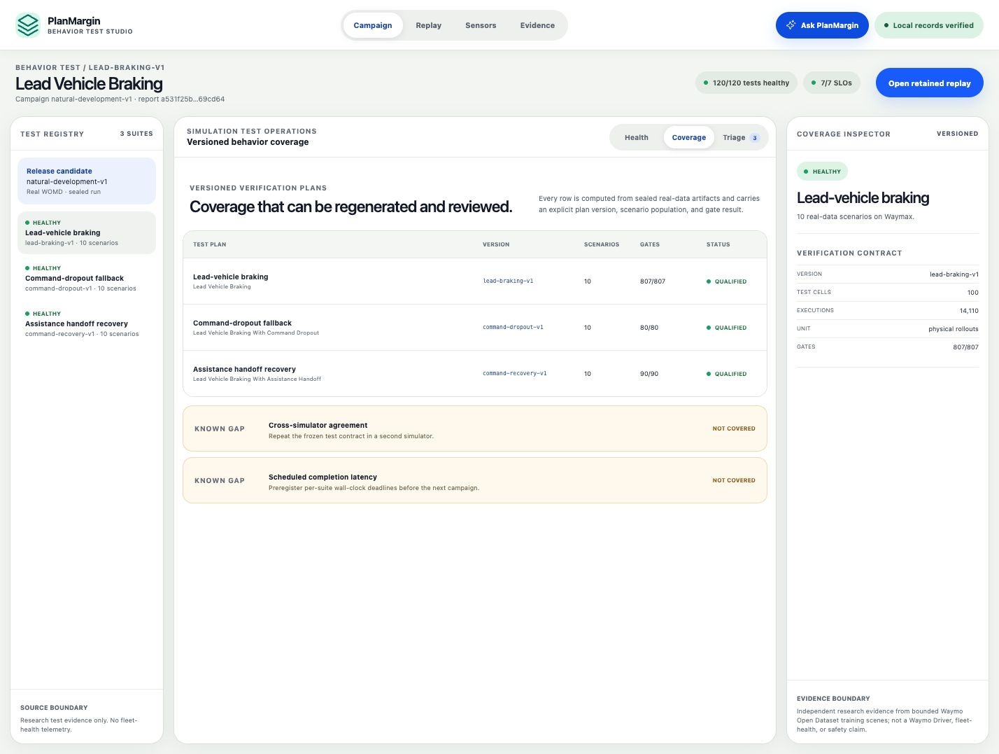
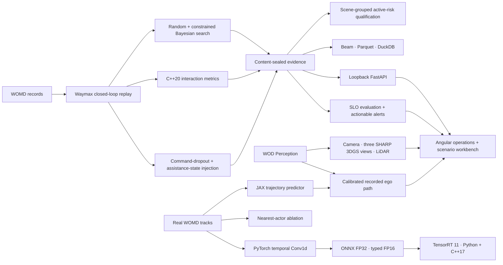

# Research evidence and implementation

These studies support PlanMargin, but are not prerequisites for running a new
planning experiment. Start with the [tool overview](../README.md) and
[experiment guide](running-experiments.md). Results below belong to their
frozen protocols; interactive jobs do not change their denominators.

## Current evidence, stated without spin

The immutable v1 development campaign evaluated 3,200 proposals across 100
matched cells. It found no qualifying planner regression. Constrained Bayesian
search produced a higher share of support-and-pipeline-valid proposals than
uniform random search, but failure-discovery efficiency and failure minimality
remain untestable because neither method found a qualifying failure. No
validation-backed comparison was opened after that no-go.

The `command-dropout-v1` verification then injected sustained primary-command
loss at 2.0 seconds across the ten selected real WOMD scenes. Baseline,
unprotected, and protected variants were each repeated, for 60 physical rollouts
and 4,800 Waymax steps. The fault manifested in 10/10 unprotected scenes; the
conservative fallback succeeded in 10/10 protected scenes; all 80 frozen
scene-level gates passed. This is an independent bounded fault model—not a
Waymo Driver fault-protection or remote-assistance claim.

A separate assistance-handoff protocol injects a temporary command dropout,
emits a request at fault detection, bridges the fault with the conservative
fallback, and resumes the primary controller after a deterministic resolution
signal. Ten of ten real-WOMD scene handoffs succeeded, ten of ten transition
traces occurred at the frozen timestamps, and all 90 scene gates passed across
60 additional physical rollouts. It tests assistance-state behavior, not a
human-operated service.

The original Stage-0 planning replay is authentic but separate from the
campaign. PlanMargin now also retains ten separately versioned replays: five
priority cases plus five additional low-margin proposals from distinct scenario
orders. Each was re-executed from its authorized WOMD source, and its
tested/reference trajectory hashes, outcomes, interaction metrics, scenario
validation, and repeated executions match the sealed v1 proposal. The other
proposal records remain hash-and-metric evidence unless they are deliberately
re-executed through the same verifier.

The WOD Perception camera and LiDAR remain separate from the WOMD/Waymax
counterfactual experiment. The Sensor Lab now contains SHARP reconstructions
for moving frame 20, approach frame 60, and stopped frame 99. At frame 20 it registers the recorded
three-second ego path, a real-WOMD-trained JAX prediction, and a constant-
velocity baseline into the SHARP source-camera coordinate system. The model is
held out by scenario and meets its absolute visualization error gates, but does
not beat constant velocity on its test scenario; the UI and report state that
negative comparison rather than claiming model superiority.

The deployable Conv1d track now covers 126,992 windows from 1,024 real WOMD
scenarios with complete-scenario train/validation/test separation. On 12,832
test windows it achieved 0.418 m ADE and 1.167 m FDE, compared with 0.870 m and
2.342 m for constant velocity. A clean repeat produced byte-identical weights
and ONNX. Its hash-pinned
[model-only release](https://github.com/ethanvillalovoz/planmargin/releases/tag/trajectory-model-v2)
contains no WOMD records.

Two Version 2 hypotheses did not pass their frozen gates. A five-model active-
risk ensemble trained on 2,097 real campaign targets reached mean held-out
Spearman 0.137 and beat matched random selection at budget eight in only 3 of 9
scenes, so no learned selector was promoted. An interaction model pooling eight
nearest actors reached 0.453 m ADE versus 0.434 m for its same-data ego-only
ablation, so it was also stopped rather than packaged.

The scaled ONNX graph was measured on a free Tesla T4 with TensorRT 11.2.1.2.
FP32 batch-1 end-to-end p50 was 0.277 ms and the independently compiled C++17
runner measured 0.153 ms. FP16 batch-1 end-to-end p50 was 0.393 ms and batch-256
throughput was 0.975M samples/s. FP16 RMSE passed at 0.0065 m, but its 0.101 m
maximum drift exceeded the frozen 0.075 m limit, so FP16 promotion is a measured
no-go. The earlier 128-scenario model retains its separate qualified result;
those values are never attributed to the scaled model.

Version 3 preregistered two bounded follow-ups. A residual-only FP16 graph
keeps smoothing and composition in host FP32; its unchanged physical probe
passed locally on Apple MPS at 0.046 m maximum error and 0.0048 m RMSE, but it
has not run on TensorRT and is not promoted. A deterministically trained DQN
with a frozen longitudinal safety envelope reduced the synthetic collision
rate to 2.686%, but missed its 1% gate and was stopped before any real-WOMD
campaign. Aggregate records preserve both results without shipping models or
licensed examples.

| Version 2 decision                     | Evidence                                                                          | Promotion                     |
| -------------------------------------- | --------------------------------------------------------------------------------- | ----------------------------- |
| Scale the deployable predictor         | 1,024 real scenes; model beats constant velocity; byte-identical repeat           | Model-only release candidate  |
| Learn which counterfactual to test     | 2,097 targets; weak scene-held-out ranking and 3/9 budget wins                    | Stopped                       |
| Add nearest-actor context              | Same 102-scene test split; worse than ego-only                                    | Stopped                       |
| Qualify the scaled ONNX on NVIDIA      | Free-T4 Python + C++17 run; FP32 and latency gates passed; FP16 max drift 0.101 m | FP16 stopped; FP32 measured   |
| Re-architect the FP16 graph            | Residual-only MPS proxy passed unchanged drift gates                              | TensorRT measurement required |
| Add a shield to the learned controller | Deterministic 2,048-episode synthetic qualification; 2.686% collisions            | Stopped at frozen 1% gate     |

Read the [aggregate result](natural-development-results.md) and
[held-out decision](decisions/0003-version-one-heldout-no-go.md) for the
frozen claim boundary.

## System architecture

| Responsibility    | Implementation                       | Verification                                                    |
| ----------------- | ------------------------------------ | --------------------------------------------------------------- |
| Simulation        | Python, JAX, Waymax                  | fixed scenario contracts and deterministic reruns               |
| Search            | PyTorch, BoTorch qLogNEHVI           | equal budgets, five seeds, frozen gates                         |
| Native metrics    | C++20, pybind11                      | randomized Python-oracle parity                                 |
| Dataflow          | Apache Beam, Parquet, DuckDB         | stable partitions and SQL reconciliation                        |
| Evidence service  | FastAPI                              | loopback auth, closed response models, path confinement         |
| Product           | Angular, TypeScript, Three.js, Spark | strict types, component tests, production build                 |
| Reconstruction    | Apple SHARP                          | pinned source, model hash, MPS/CUDA/CPU execution               |
| Trajectory model  | JAX, Optax, real WOMD tracks         | scenario holdout, baseline comparison, sealed checkpoint        |
| Deployable model  | PyTorch, ONNX, TensorRT 11           | 1,024-scenario holdout, constant-velocity baseline, byte repeat |
| Learned mining    | PyTorch ensemble, grouped CV         | rank, budgeted selection, calibration, and no-go gates          |
| Interaction study | PyTorch nearest-actor pooling        | same-data ego-only ablation and no-go gate                      |
| NVIDIA runtime    | Python and C++17 `enqueueV3`         | device plus pinned-host end-to-end p50/p95/p99 contract         |
| Assistant         | deterministic tools, optional Gemini | ten routed evidence topics, sealed citations, local greeting/help; no chat memory |
| Replay retention  | Python, JAX, Waymax                  | proposal seal, trajectory-hash and metric matching              |
| Test operations   | Python, DuckDB, JSON Schema          | saved SLI checks, versioned suites, diagnostic paths, sealed report   |
| Fault protection  | JAX, Waymax                          | 60 repeated rollouts and 80/80 frozen scene gates               |
| Assistance V&V    | JAX, Waymax                          | 60 repeated rollouts, exact transitions, 90/90 frozen gates     |

## Reproduce the NVIDIA runtime study

Open [the TensorRT notebook](../notebooks/planmargin_tensorrt_colab.ipynb) in a
free T4 Colab runtime when one is available. It downloads the hash-pinned
model-only release, builds FP32 and typed-FP16 engines, measures batches 1, 8,
and 256, and compiles the C++17 cross-check. GPU availability is not guaranteed
by Colab. TensorRT is not required by the interactive planning runner.

See [workspace reproduction](reproducing-the-workspace.md) for the separate
camera, LiDAR, 3DGS, Beam, JAX, and PyTorch pipelines.
