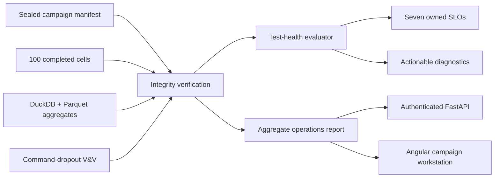

# Simulation test operations

PlanMargin's default surface is an operational view of one sealed, real-data
simulation campaign. It is designed around two questions that must not be
collapsed into a single green or red badge:

1. **Did the test system execute correctly?**
2. **What did the tested behavior do?**

A healthy campaign can find no regression. A broken pipeline can also appear to
find nothing. The Campaign workspace keeps those outcomes separate.

## Evidence flow



`planmargin-build-test-operations` reconstructs the report from the private,
seal-verified workspace. It refuses incomplete campaigns, mismatched analytics,
unexpected experiment states, unbalanced budgets, missing exact replays, and a
failed fault-protection qualification. The generated public JSON contains
aggregates only and is validated by
[`test-operations-report-v2.schema.json`](../schemas/test-operations-report-v2.schema.json).

The v2 contract adds a real test-suite inventory, versioned behavior plans,
numeric SLI/objective fields, remaining error-budget state, and a deterministic
root-cause path for every alert or held engineering decision. The Campaign UI
uses that contract for three distinct tasks: release health, behavior coverage,
and failure triage. It does not duplicate the same status across a dashboard,
queue, and inspector.

## Health contract

The health evaluator has seven independently owned objectives:

| Objective                   | Owner              | Failure response                                        |
| --------------------------- | ------------------ | ------------------------------------------------------- |
| Campaign cells complete     | orchestration      | Resume from the first incomplete checkpoint             |
| Integrity checks pass       | evidence pipeline  | Quarantine the affected record and reconcile seals      |
| Proposal budget exact       | search coordinator | Finish missing work before comparing methods            |
| Matched method budgets      | experiment design  | Reject an unbalanced comparison                         |
| Retained replays verified   | replay evidence    | Rebuild the missing replay from its sealed proposal     |
| Command-dropout fallback    | behavior V&V       | Block promotion and inspect the failed rollout          |
| Assistance handoff recovery | behavior V&V       | Block promotion and inspect the failed state transition |

Unit tests exercise both the current healthy report and a deliberately degraded
test input. The latter is a software-contract fixture—not displayed experiment
data—and must produce one actionable alert for every failed SLO. The product
surface itself loads only the sealed real-data aggregate report.

## Test registry and triage

The registry currently exposes three independently versioned plans built from
the repository's measured artifacts:

| Plan | Responsibility | Measured evidence |
| --- | --- | --- |
| `lead-braking-v1` | matched counterfactual behavior campaign | 100 cells, 14,110 physical rollouts, 807/807 integrity gates |
| `command-dropout-v1` | sustained command-loss fallback | 10 real-data scenes, 60 rollouts, 80/80 gates |
| `command-recovery-v1` | assistance request, resolution, and recovery | 10 real-data scenes, 60 rollouts, 90/90 gates |

Triage uses measured no-go or pending results rather than fabricated incidents.
Each item names its detector, owner, operational impact, isolation path,
resolution, prevention rule, source record, and failed gates. Pipeline-health
alerts use the same shape when a regenerated report violates an SLO.

## Fault-injection verification

The `command-dropout-v1` protocol injects a sustained primary-planner command
dropout at 2.0 seconds in ten deterministically selected WOMD training scenes.
For each scene, PlanMargin runs baseline, unprotected, and protected variants
twice:

- the unprotected variant holds the last commanded pose, making the fault
  observable;
- the protected variant switches to a conservative Waymax IDM fallback;
- repeated trajectories must be byte-for-byte deterministic;
- the protected trajectory must remain valid and recover meaningful progress.

The final sustained-fault qualification executed 60 physical rollouts and 4,800 Waymax steps.
All ten protected scenes succeeded and all 80 scene-level gates passed. The
privacy-safe aggregate is
[`fault-protection-command-dropout-v1.json`](../experiments/fault-protection-command-dropout-v1.json).
Per-scene traces and identifiers remain under ignored `artifacts/` paths.

The first protocol attempt incorrectly represented command loss as an invalid
Waymax action. Waymax responded with log-following fallback behavior, so the
fault did not manifest and the run correctly failed its gate. The implementation
was corrected to a zero-order hold, the failed run was retained locally, and the
full protocol was rerun without changing thresholds. This history is recorded
in [ADR 0011](decisions/0011-command-dropout-fault-protection.md).

A second protocol covers assistance-behavior testing without claiming a real
remote operator. It injects a temporary command dropout, emits an assistance
request at detection, holds the conservative fallback for one second, applies a
deterministic assistance-resolution signal, and verifies that the primary
controller resumes. Across 60 additional rollouts, all ten handoffs succeeded,
all ten request/recovery transition traces occurred at the frozen timestamps,
and all 90 scene-level gates passed. See
[ADR 0012](decisions/0012-assistance-handoff-v-and-v.md).

## Run and verify

```bash
uv run --frozen planmargin-verify-fault-protection
uv run --frozen planmargin-verify-assistance-handoff
uv run --frozen planmargin-build-test-operations
uv run --frozen pytest tests/test_fault_protection.py tests/test_assistance_handoff.py tests/test_test_operations.py
```

The first command requires the authorized local Stage-0 WOMD selection. The
tracked aggregate report lets a public clone verify the result without receiving
licensed scene data.

## Claim boundary

This is independent research on bounded Waymo Open Dataset training scenes. It
is not Waymo Driver fault protection, a human-operated remote-assistance
implementation, fleet health telemetry, or a safety claim. Cross-simulator
agreement and scheduled completion latency remain visible as open coverage
gaps. PlanMargin records work duration, but no wall-clock deadline was
preregistered, so it does not relabel completion as an on-time SLO after the
fact.
